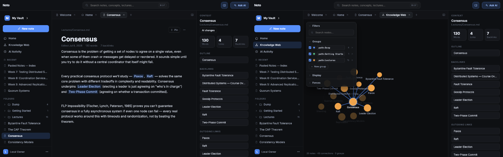
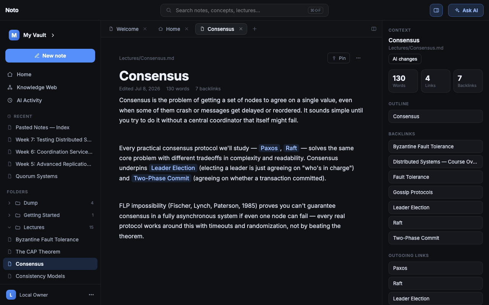
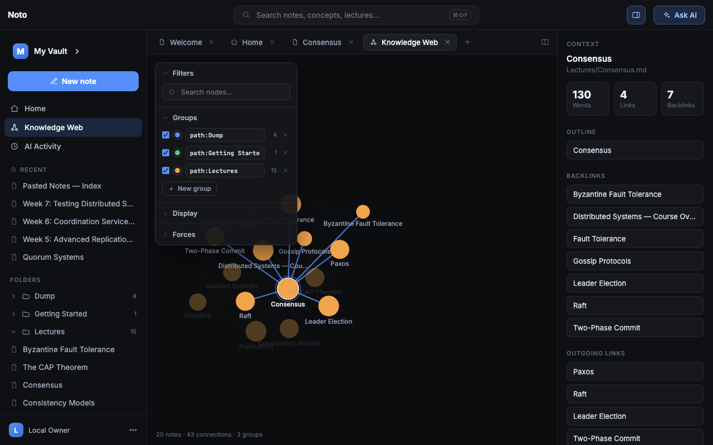
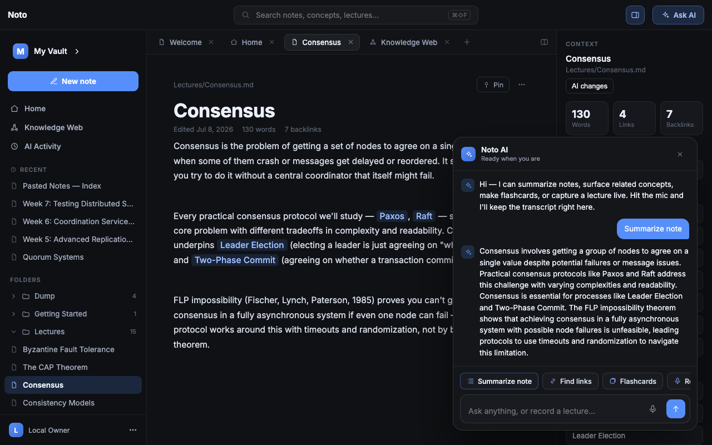
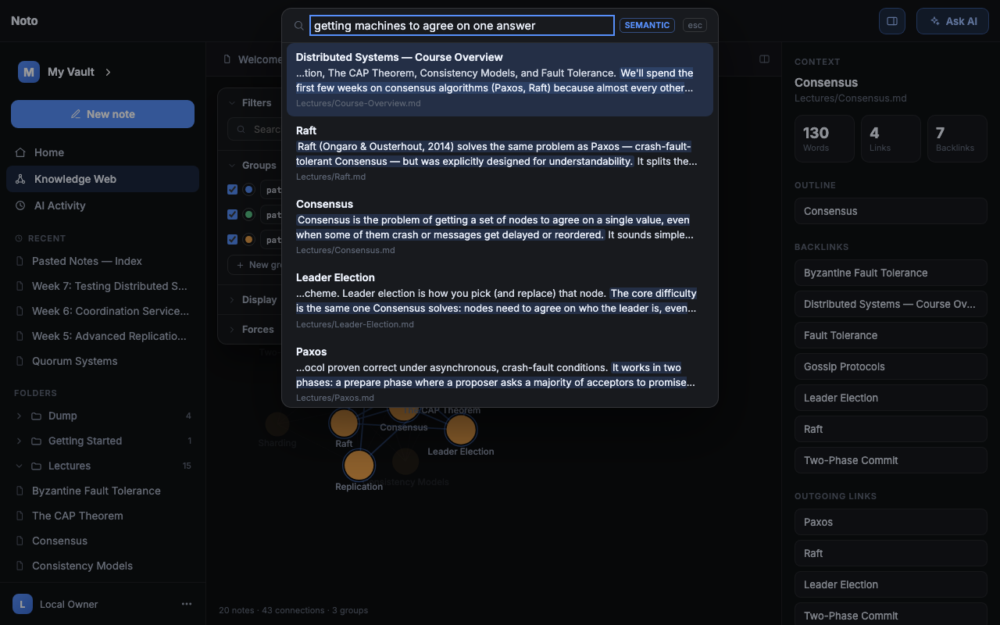
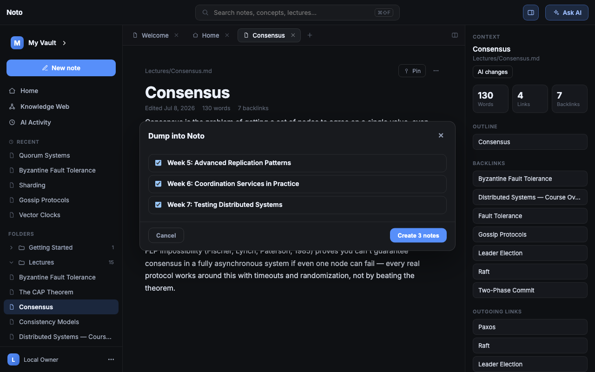
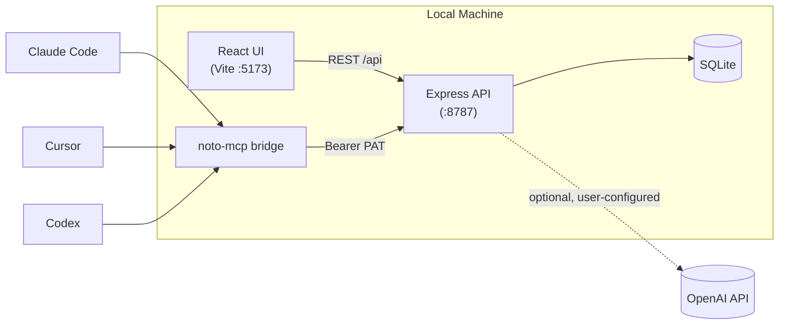
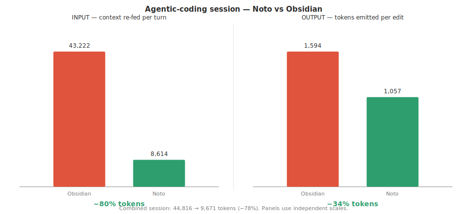

# Noto

<div align="center">

[](LICENSE)
[](https://github.com/doomwoodzz/Noto/actions/workflows/ci.yml)
[](https://nodejs.org)
[](https://pypi.org/project/noto-app/)
[](https://pypi.org/project/noto-app/)

### When you listen, Noto remembers.

A local-first Markdown notes workspace with an AI lecture-listening assistant, run entirely on your own machine.

</div>

## Contents

- [Quick install](#quick-install)
- [Feature tour](#feature-tour)
- [Noto vs. the alternatives](#noto-vs-the-alternatives)
- [Architecture](#architecture)
- [Benchmarks](#benchmarks)
- [Developing](#developing)
- [Local-first](#local-first)
- [Contributing](#contributing)
- [License](#license)



Noto runs entirely on your own machine. There are no accounts, no sign-in, and no
hosted server to operate — your notes live in a local SQLite database and nothing
leaves your computer except the optional AI/connector calls you explicitly configure.

## Quick install

```bash
pip install noto-app
noto
```

This opens Noto in your browser at `http://127.0.0.1:8787`. The first run downloads a
small, checksum-verified Node.js runtime (Noto itself is a Node/TypeScript app under
the hood); later runs start instantly. No separate Node.js install is required.

## Feature tour

### Markdown notes, wiki-links, and backlinks



Write in plain Markdown. Link notes with `[[wiki-links]]` and Noto builds the
backlinks automatically — the context panel on the right always shows what links
here and what this note links to.

### Knowledge Web



A canvas-based, force-directed graph of your whole vault. Notes cluster by how
they actually connect — structural `[[links]]` first, with semantic edges filled
in automatically for under-linked notes so isolated ideas still find their
neighbors.

### AI Assistant



An OpenAI-backed assistant that reads the note you're on: chat, summarize,
generate flashcards, find related notes, or transcribe a live lecture straight
into structured, linked notes. Bring your own API key — nothing AI-related runs
unless you configure one.

### Smart Search



Semantic search (`⌘⇧F`) that runs entirely on your machine using local MiniLM
embeddings — no vault content ever leaves your computer just to search it, and it
finds notes by meaning, not just keyword overlap.

### Dump



Paste a document, upload files, or pull from GitHub/Notion, and Dump splits the
source material into atomic, reviewable notes before anything is committed to
your vault.

### MCP bridge

Claude Code, Cursor, and Codex can read and write your vault directly through
`noto-mcp`, a small stdio MCP server authenticated by a personal access token —
see [Architecture](#architecture) below for how that fits together.

## Noto vs. the alternatives

|  | Noto | Obsidian | Notion | Logseq | Mem |
|---|---|---|---|---|---|
| Local-first (data lives on your disk) | ✅ | ✅ | ❌ | ✅ | ❌ |
| No account / sign-in required | ✅ | ✅ | ❌ | ✅ | ❌ |
| Open source | ✅ | ❌ | ❌ | ✅ | ❌ |
| Built-in AI (chat, lecture transcription, flashcards) | ✅ | plugin-only | ✅ (paid tier) | plugin-only | ✅ (core) |
| Knowledge graph view | ✅ | ✅ | ❌ | ✅ | ❌ |
| MCP / AI-agent bridge | ✅ | ❌ | ✅ (official, hosted) | ❌ | ❌ |

## Architecture



Everything inside "Local Machine" never leaves your device unless you explicitly
configure the optional OpenAI edge. `db.ts` is the only module that touches SQL;
`noto-mcp` authenticates over `Authorization: Bearer` and bypasses session/CSRF
entirely, the same way it would for any other API client.

## Benchmarks



Noto's MCP memory layer (semantic retrieval + response caching) cuts token usage
on agentic coding sessions by ~78% combined versus a naive full-vault-dump
baseline — driven mostly by input-side retrieval savings (~80%); output-side
savings from response caching are more modest (~34%). See
[`docs/benchmarks/`](docs/benchmarks/) for the full input/output breakdown and
methodology.

## Developing

Requires [Node.js](https://nodejs.org) 24+.

```bash
cd landing
npm install
npm run dev          # starts the Vite client + Express API together
npm test             # runs the test suite
```

AI features and connectors are optional and gated on environment variables — see
[`landing/.env.example`](landing/.env.example).

## Local-first

Your data stays on your device: the server persists everything to a local SQLite
database (under `landing/server/data/` in development, or your OS's standard app-data
directory when installed via `pip install noto-app`). AI and connector features only
reach out when you configure their keys.

## Contributing

Issues and PRs are welcome — see [CONTRIBUTING.md](CONTRIBUTING.md) for dev setup
and PR expectations.

## License

MIT
