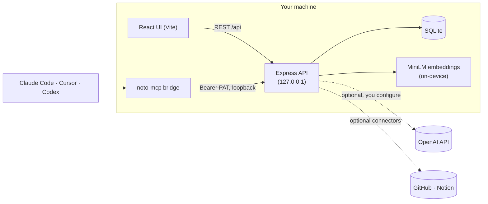

# Noto

[](LICENSE)
[](https://github.com/doomwoodzz/Noto/actions/workflows/ci.yml)
[](https://pypi.org/project/noto-app/)


**Local-first Markdown notes with a retrieval layer built for AI agents.**

> When you listen, Noto remembers.

Noto embeds every note on-device and serves an AI agent only the semantically
relevant slice of your vault over [MCP](https://modelcontextprotocol.io) — instead of
dumping the whole vault into its context window. On the bundled benchmark vault that
cuts the **input tokens an agent spends on context by ~76–78%**, and **the saving grows
with the corpus** (94.8% at 71 notes, 97.5% at 151). That corpus-scaling is the real
differentiator: the more you write, the more an agent saves reading it.

Retrieval runs **entirely on your machine.** The embedding model (MiniLM) is downloaded
once and runs locally, so semantic search never sends your notes anywhere — there are
no accounts, no hosted server, and nothing leaves your computer except the optional
AI/connector calls you explicitly configure.

<!-- DEMO PLACEHOLDER — needs manual capture. Do NOT reuse landing/public/images/*.{jpg,png};
     those are AI-generated stock art, not product screenshots. Capture in dark mode from a
     demo vault; see docs/superpowers/specs/2026-07-08-noto-github-readme-design.md for the plan. -->
> 📸 **Demo screenshot/GIF goes here** — _not yet captured._ Suggested: the three-pane
> workspace beside the Knowledge Web graph, dark mode.

## Contents

- [Install](#install) · [What works today](#what-works-today) · [Roadmap](#roadmap)
- [Connect an AI agent (MCP)](#connect-an-ai-agent-mcp) · [Architecture](#architecture)
- [How the token savings work](#how-the-token-savings-work) · [Noto vs. other tools](#noto-vs-other-tools)
- [Developing](#developing) · [Local-first & privacy](#local-first--privacy)
- [Contributing](#contributing) · [Security](#security) · [License](#license)

## Install

```bash
pip install noto-app
noto
```

This opens Noto in your browser at `http://127.0.0.1:8787`. The first run downloads a
small, checksum-verified Node.js runtime (Noto is a Node/TypeScript app under the hood)
and a local embedding model; later runs start instantly. No separate Node.js install is
required.

## What works today

- **Local semantic search** — "Smart Search" over your notes using MiniLM embeddings +
  SQLite FTS5, running entirely on-device.
- **MCP bridge** (`noto-mcp`) — expose your vault to MCP-compatible agents (Claude Code,
  Cursor, Codex). Nine tools: five read + four write, authenticated by a local token.
- **Markdown notes** with `[[wiki-links]]` and automatically generated backlinks.
- **Knowledge Web** — a force-directed graph view of how your notes link together.
- **Dump** — bulk-import from **paste, file upload, GitHub, and Notion**; long documents
  are split into atomic notes, deduplicated, and (optionally) enriched with AI-generated
  titles/tags/links. GitHub and Notion require one-time connector setup; paste and upload
  work with no configuration.
- **AI assistant** (optional, bring your own OpenAI key) — chat, summarize, flashcards,
  find-links, and lecture transcription.
- **Local-first storage** — a local SQLite database, no accounts, no server to operate.

## Roadmap

In progress — **not yet shipped**, and deliberately listed separately:

- **Semantic + clustered knowledge graph in the UI.** The backend already computes
  MiniLM-based *semantic* edges between under-linked notes and groups notes into
  communities (Louvain), cached in SQLite; surfacing that in the Knowledge Web view is
  in progress. Today the graph view shows structural (`[[wiki-link]]` + tag)
  connections.
- **Graphify-inspired ingestion pipeline.** Turning imported/raw content into a graph of
  extracted entities and relationships. Design stage — not yet built.

## Connect an AI agent (MCP)

`noto-mcp` is a stdio MCP server that bridges an agent to your local Noto vault. Mint a
Personal Access Token from Noto's in-app **MCP setup** panel, then point your MCP client
at `noto-mcp` with two environment variables:

```jsonc
{
  "mcpServers": {
    "noto": {
      "command": "noto-mcp",
      "env": {
        "NOTO_URL": "http://127.0.0.1:8787",
        "NOTO_TOKEN": "<your personal access token>"
      }
    }
  }
}
```

The agent can **read across your whole vault** (`search_notes`, `list_notes`, `get_note`,
`get_section`, `recall`) but can only **write into a `Memory/` folder** (`create_note`,
`append_note`, `update_section`, `remember`) — it cannot modify or delete your existing
notes. See [SECURITY.md](SECURITY.md) for the full agent threat model.

## Architecture

Everything inside **Your machine** stays local. Only the dashed edges leave the device,
and only when you configure them.



## How the token savings work

The **baseline** an agent faces without Noto is to re-send the whole vault as context.
The **optimized** path calls Noto's real semantic search (FTS5 + MiniLM cosine, top-K)
and sends back only the hits. Input tokens are counted with `gpt-tokenizer` (o200k_base)
as a provider-neutral proxy; the retrieval is the real code path, not a mock.

The saving **scales with corpus size**, because the retrieved slice stays roughly fixed
while the baseline grows with the vault:

| Notes in vault | Baseline tokens | Retrieved tokens | Input saved |
|--:|--:|--:|--:|
| 11 | 3,366 | 785 | **76.7%** |
| 31 | 7,252 | 788 | **89.1%** |
| 71 | 15,096 | 784 | **94.8%** |
| 151 | 30,639 | 779 | **97.5%** |

Across a 10-query session the mean per-query reduction is **78.7%** (median 76.8%), and a
cross-check against a real model API measured **83.4%** on its sample. Retrieval is an
**input-side** optimization — it does not reduce the model's *output* tokens.

Measured on a benchmark vault (a real 11-note fixture plus synthetic notes for the
scaling sweep). Full methodology, per-query detail, and charts live in
[`docs/benchmarks/`](docs/benchmarks/token-savings/report.md); regenerate with
`cd landing && npm run benchmark:tokens`.

## Noto vs. other tools

|  | Noto | Obsidian | Notion | Logseq | Mem |
|---|:--:|:--:|:--:|:--:|:--:|
| Local-first (data on your disk) | ✅ | ✅ | ❌ | ✅ | ❌ |
| No account / sign-in required | ✅ | ✅ | ❌ | ✅ | ❌ |
| Open source | ✅ | ❌ | ❌ | ✅ | ❌ |
| On-device semantic search | ✅ | plugin-only | ❌ | plugin-only | ❌ |
| Knowledge-graph view | ✅ | ✅ | ❌ | ✅ | ❌ |
| MCP / AI-agent bridge | ✅ | ❌ | ❌ | ❌ | ❌ |

<!-- FACT-CHECK the competitor columns before publishing — these are not verifiable from
     this repo and third-party products change quickly. -->
> _The Noto column is verified against this repository. Competitor columns reflect
> general knowledge as of early 2026 and are **not** verified from this repo — please
> re-check them before publishing._

## Developing

Requires [Node.js](https://nodejs.org) 24+.

```bash
cd landing
npm install
npm run dev            # Vite client (5173) + Express API (8787) together
npm test               # Vitest
npm run typecheck:server
npm run lint
npm run build          # production build (tsc -b && vite build)
```

`npm run dev` downloads the local MiniLM model on first run ("Smart Search assets
ready."). AI features and connectors are optional and gated on environment variables —
see [`landing/.env.example`](landing/.env.example). The `noto-mcp` bridge is a separate
package (`cd noto-mcp && npm install && npm run build`). For an architecture overview and
per-directory map, see [CLAUDE.md](CLAUDE.md).

## Local-first & privacy

Your data stays on your device: the server binds `127.0.0.1` only and persists
everything to a local SQLite database (under `landing/server/data/` in development, or
your OS's standard app-data directory when installed via `pip install noto-app`).
Semantic search runs on a local MiniLM model. AI and connector features reach out only
when you configure their keys, and your OpenAI key is used server-side only, never
exposed to the browser.

## Contributing

Contributions are welcome — see [CONTRIBUTING.md](CONTRIBUTING.md) for local setup and
the PR process. Please report security issues privately per [SECURITY.md](SECURITY.md).

## Security

Noto runs locally with no accounts, and treats content imported via Dump as untrusted
(prompt-injection defenses, secret redaction). The agent-facing MCP surface is
constrained (read-anywhere, write-only-to-`Memory/`, no delete). Details and the full
threat model are in [SECURITY.md](SECURITY.md).

## License

[MIT](LICENSE) © 2026 Aleksandr Vanin
