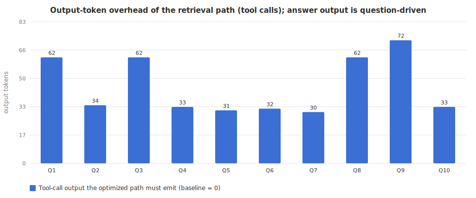

# Output-Token Test — does retrieval save output tokens?

_Generated 2026-06-29T19:59:48.994Z · 10 queries × 2 conditions · model gpt-4o-mini (temperature 0, max_tokens 400) · real API `usage.completion_tokens`_

## Short answer

**No — retrieval does not save output tokens.** The final answer is driven by the *question*, not by how the context was assembled, so output (completion) tokens are ~the same whether the model is given the whole corpus or only the retrieved top-K. The optimized MCP path in fact emits a little **more** output, because the model has to generate the `search_notes` / `recall` tool calls (45.1 tokens/query here). Retrieval is an **input-side** optimization; the big win (≈76% input reduction) is in [report.md](report.md).

## Numbers

| Metric | Value |
|---|--:|
| Mean answer output — baseline (full dump) | 37.4 tokens |
| Mean answer output — optimized (retrieval) | 44.3 tokens |
| Mean answer-output difference | -6.9 tokens (-18.4%) |
| Mean tool-call output overhead (optimized only) | +45.1 tokens |
| **Net output effect of optimized path** | **-52.0 tokens/query** (negative = emits more) |
| Input cross-check (real API prompt_tokens) | 1167 → 194 (83.4% saved) |

## Per-query detail

| # | Scenario | Output base | Output opt | Δ out | Tool-call + | Input base | Input opt |
|---|---|--:|--:|--:|--:|--:|--:|
| Q1 | combined | 53 | 54 | -1 | +62 | 1166 | 334 |
| Q2 | notes | 14 | 29 | -15 | +34 | 1168 | 175 |
| Q3 | combined | 56 | 55 | +1 | +62 | 1166 | 341 |
| Q4 | notes | 29 | 27 | +2 | +33 | 1167 | 63 |
| Q5 | memory | 45 | 97 | -52 | +31 | 1165 | 175 |
| Q6 | memory | 18 | 18 | +0 | +32 | 1166 | 173 |
| Q7 | notes | 30 | 59 | -29 | +30 | 1164 | 56 |
| Q8 | combined | 24 | 22 | +2 | +62 | 1166 | 316 |
| Q9 | combined | 68 | 45 | +23 | +72 | 1171 | 123 |
| Q10 | memory | 37 | 37 | +0 | +33 | 1167 | 179 |

---

_Regenerate with `cd landing && npm run benchmark:output` (makes 20 real gpt-4o-mini calls)._
