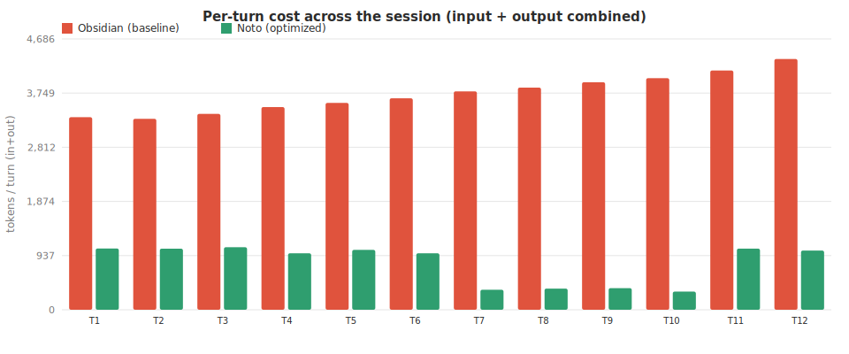
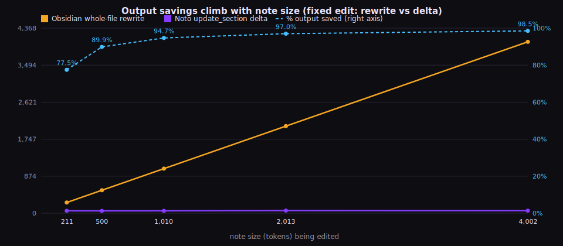

# Noto — Shared-Memory Token-Savings Benchmark

_Generated 2026-07-09T08:32:58.051Z · tokenizer: gpt-tokenizer o200k_base (GPT-4o encoding; provider-neutral proxy) · embedder ready: **true** (real MiniLM semantic retrieval)_

## Headline

| Metric | Value |
|---|--:|
| Mean per-query token reduction | **78.7%** |
| Session-total reduction | **77.7%** |
| Tokens saved across 10 queries | **18,305** |
| Mean tokens / query (baseline → optimized) | 2,357 → 526 |

## What this measures

- **Baseline** (naive, no retrieval): dump the whole corpus — all 11 note bodies + the full active-memory store (30 memories) — into the prompt, serialized as the JSON the MCP tool layer hands the model.
- **Optimized** (shared-memory MCP path): the real `semanticSearchNotes` / `semanticRecall` (FTS5 + MiniLM cosine, 0.25 floor) returning only the top-K hits (notes K=5, recall K=6).
- **Token saving** = reduction in input (prompt) tokens.

## Charts

> Notes beyond the first 11 are synthetic, in the same shape, used only to plot how savings scale with corpus size.

## Summary statistics

| Statistic | Value |
|---|--:|
| Queries | 10 |
| Mean per-query savings | 78.7% |
| Median per-query savings | 76.9% |
| Min / Max per-query savings | 62.6% / 93.3% |
| Mean baseline tokens / query | 2,357 |
| Mean optimized tokens / query | 526 |
| Session total — baseline | 23,569 tokens |
| Session total — optimized | 5,264 tokens |
| Session total — saved | 18,305 tokens (77.7%) |

## Per-query detail

| # | Query | Scenario | Baseline | Optimized | Saved | % |
|---|---|---|--:|--:|--:|--:|
| Q1 | How do plants convert light into chemical energy? | combined | 3,367 | 955 | 2,412 | **72%** |
| Q2 | What is the role of carbon dioxide in photosynthesis? | notes | 1,107 | 414 | 693 | **63%** |
| Q3 | Explain how chloroplasts relate to glucose production | combined | 3,367 | 978 | 2,389 | **71%** |
| Q4 | What were the main tensions after World War II? | notes | 1,107 | 75 | 1,032 | **93%** |
| Q5 | How should I structure my study sessions? | memory | 2,260 | 520 | 1,740 | **77%** |
| Q6 | What did I decide about summarizing lectures? | memory | 2,260 | 515 | 1,745 | **77%** |
| Q7 | Themes of ambition and guilt in literature | notes | 1,107 | 74 | 1,033 | **93%** |
| Q8 | How do enzymes affect chemical reactions in cells? | combined | 3,367 | 951 | 2,416 | **72%** |
| Q9 | What is a logarithm and how does it relate to exponents? | combined | 3,367 | 259 | 3,108 | **92%** |
| Q10 | Remind me of the office hours and exam details | memory | 2,260 | 523 | 1,737 | **77%** |

## Output tokens?

The savings above are **input-side** (retrieval). Output (completion) tokens are **not** reduced by retrieval — they are driven by the question. Output savings come from a separate mechanism: Noto's write-back primitives (`append_note`, `update_section`, structured `remember()`). The [deep agentic-coding session](#deep-agentic-coding-session--input-and-output) below measures both directions. See also [report-output.md](report-output.md) (AI-response cache, `npm run benchmark:output`).

## Deep agentic-coding session — input *and* output

A 12-turn agent working inside a Noto vault: read context → recall memory → edit a note → record a decision → iterate.

- **Noto** = real semantic top-K retrieval (input) + `append_note`/`update_section` deltas and structured `remember()` (output).
- **Obsidian** = the conservative baseline. Out of the box it has no agent semantic-retrieval and no MCP write-back/patch layer, so an agent driving it re-feeds the whole vault each turn and re-emits whole note bodies on every edit. A raw no-tool agent is equal or worse.

| Direction | Obsidian (baseline) | Noto (optimized) | Saved | % |
|---|--:|--:|--:|--:|
| Input (context per turn) | 43,190 | 8,515 | 34,675 | **80.3%** |
| Output (tokens emitted) | 1,594 | 1,060 | 534 | **33.5%** |
| **Combined** | 44,784 | 9,575 | 35,209 | **78.6%** |

### Where output savings come from — and where they don't

Retrieval is an **input**-side win; it does not reduce output. The **output** savings come entirely from Noto's write primitives: `append_note` / `update_section` emit only the changed text instead of the whole note, and `remember()` persists a decision as one short structured write instead of restating it inline.

Honesty caveats:
- The output saving is measured against a **whole-file-rewrite** baseline. An agent harness with its own native diff/patch tool already captures part of it; Noto's contribution is providing that primitive over a *remote* notes store where the alternative is a full-body write.
- `create_note` (new files) emits full content in **both** paths — no output saving there.
- On this vault the notes are small (study notes), so the measured session output saving is a modest **33.5%**. The leverage grows with note size:

> A fixed-size edit emitted as a whole-file rewrite vs an update_section delta, over synthetic note bodies of increasing size. The delta stays flat; the rewrite scales with the note, so output savings climb toward 100% on large notes/files (the deep-agentic-coding regime). Bodies are synthetic, labeled here.

| Note size (tokens) | Rewrite (Obsidian) | Delta (Noto) | Output saved |
|--:|--:|--:|--:|
| 211 | 253 | 57 | **77.5%** |
| 500 | 542 | 55 | **89.9%** |
| 1,010 | 1,052 | 56 | **94.7%** |
| 2,013 | 2,055 | 62 | **97.0%** |
| 4,002 | 4,044 | 60 | **98.5%** |

**Assumptions (stated honestly):** Obsidian out of the box has no agent semantic-retrieval and no MCP write-back/patch layer, so an agent driving it uses full-context reads and whole-file writes — identical to the naive baseline. A raw/no-tool agent is equal or worse, so Obsidian is the conservative baseline. Output savings are vs a whole-file-rewrite baseline. An agent harness with its own native diff/patch tool already captures part of this; Noto's contribution is providing append/section-patch primitives over a remote notes store where the alternative is a full-body write. create_note (new files) emits full content in BOTH paths — no output saving there, and the session contains none.

## Corpus-scaling detail

| Notes in corpus | Mean baseline | Mean optimized | Mean savings |
|--:|--:|--:|--:|
| 11 | 3,375 | 785 | 76.8% |
| 31 | 7,265 | 793 | 89.1% |
| 71 | 15,087 | 816 | 94.6% |
| 151 | 30,723 | 836 | 97.3% |

---

_Corpus: landing/src/noto/mockVault.ts (real fixture) + curated Noto memory fixture (this script). Regenerate with `cd landing && npm run benchmark:tokens`._
