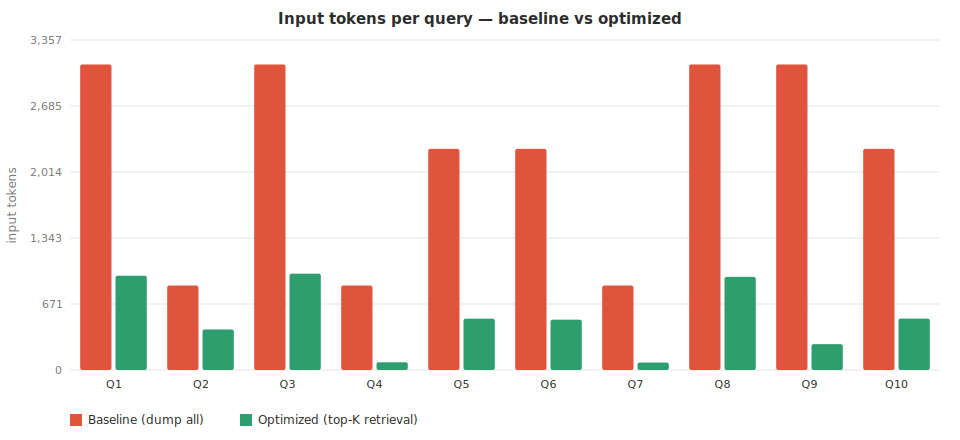
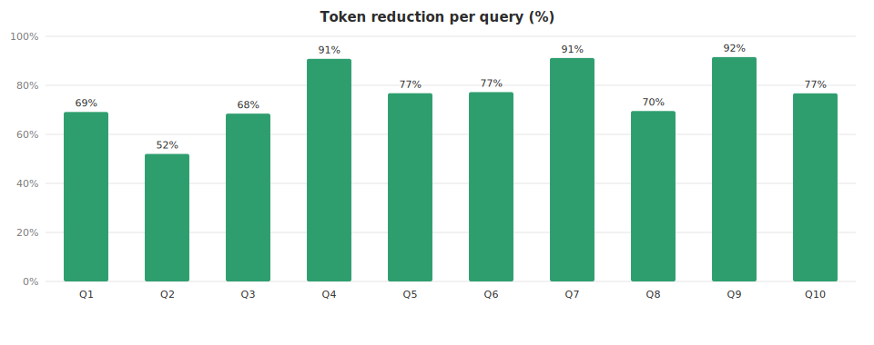
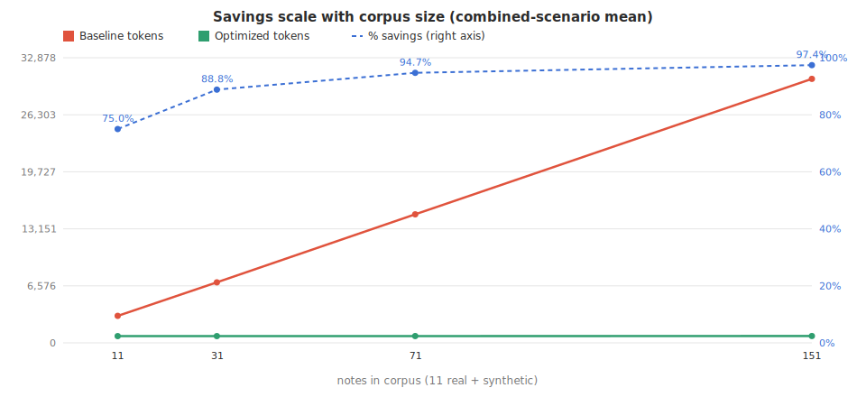

# Noto — Shared-Memory Token-Savings Benchmark

_Generated 2026-06-29T19:09:56.409Z · tokenizer: gpt-tokenizer o200k_base (GPT-4o encoding; provider-neutral proxy) · embedder ready: **true** (real MiniLM semantic retrieval)_

## Headline

| Metric | Value |
|---|--:|
| Mean per-query token reduction | **76.2%** |
| Session-total reduction | **75.7%** |
| Tokens saved across 10 queries | **16,451** |
| Mean tokens / query (baseline → optimized) | 2,174 → 528 |

## What this measures

- **Baseline** (naive, no retrieval): dump the whole corpus — all 11 note bodies + the full active-memory store (30 memories) — into the prompt, serialized as the JSON the MCP tool layer hands the model.
- **Optimized** (shared-memory MCP path): the real `semanticSearchNotes` / `semanticRecall` (FTS5 + MiniLM cosine, 0.25 floor) returning only the top-K hits (notes K=5, recall K=6).
- **Token saving** = reduction in input (prompt) tokens.

## Charts

> Notes beyond the first 11 are synthetic, in the same shape, used only to plot how savings scale with corpus size.

## Summary statistics

| Statistic | Value |
|---|--:|
| Queries | 10 |
| Mean per-query savings | 76.2% |
| Median per-query savings | 76.9% |
| Min / Max per-query savings | 50.5% / 91.6% |
| Mean baseline tokens / query | 2,174 |
| Mean optimized tokens / query | 528 |
| Session total — baseline | 21,735 tokens |
| Session total — optimized | 5,284 tokens |
| Session total — saved | 16,451 tokens (75.7%) |

## Per-query detail

| # | Query | Scenario | Baseline | Optimized | Saved | % |
|---|---|---|--:|--:|--:|--:|
| Q1 | How do plants convert light into chemical energy? | combined | 3,105 | 959 | 2,146 | **69%** |
| Q2 | What is the role of carbon dioxide in photosynthesis? | notes | 859 | 425 | 434 | **51%** |
| Q3 | Explain how chloroplasts relate to glucose production | combined | 3,105 | 985 | 2,120 | **68%** |
| Q4 | What were the main tensions after World War II? | notes | 859 | 76 | 783 | **91%** |
| Q5 | How should I structure my study sessions? | memory | 2,246 | 519 | 1,727 | **77%** |
| Q6 | What did I decide about summarizing lectures? | memory | 2,246 | 511 | 1,735 | **77%** |
| Q7 | Themes of ambition and guilt in literature | notes | 859 | 72 | 787 | **92%** |
| Q8 | How do enzymes affect chemical reactions in cells? | combined | 3,105 | 956 | 2,149 | **69%** |
| Q9 | What is a logarithm and how does it relate to exponents? | combined | 3,105 | 261 | 2,844 | **92%** |
| Q10 | Remind me of the office hours and exam details | memory | 2,246 | 520 | 1,726 | **77%** |

## Output tokens?

These savings are **input-side**. Output (completion) tokens are driven by the question, not by how context is assembled, so retrieval does not reduce them — the MCP path even emits slightly *more* output (the tool calls). See [report-output.md](report-output.md) (`npm run benchmark:output`).

## Corpus-scaling detail

| Notes in corpus | Mean baseline | Mean optimized | Mean savings |
|--:|--:|--:|--:|
| 11 | 3,122 | 784 | 74.9% |
| 31 | 7,021 | 780 | 88.9% |
| 71 | 14,801 | 793 | 94.6% |
| 151 | 30,380 | 779 | 97.4% |

---

_Corpus: landing/src/noto/mockVault.ts (real fixture) + curated Noto memory fixture (this script). Regenerate with `cd landing && npm run benchmark:tokens`._
