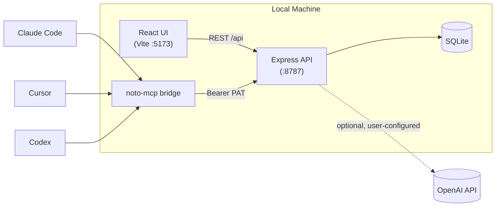

# Noto GitHub README Implementation Plan

> **For agentic workers:** REQUIRED SUB-SKILL: Use superpowers:subagent-driven-development (recommended) or superpowers:executing-plans to implement this plan task-by-task. Steps use checkbox (`- [ ]`) syntax for tracking.

**Goal:** Replace Noto's bare 58-line `README.md` with a visually-driven, credible README (real screenshots, a Mermaid architecture diagram, a comparison table, one restyled benchmark chart), and ship it bundled with a minimal CI workflow, a public GitHub repo, and a published PyPI package.

**Architecture:** A purpose-built demo vault ("Introduction to Distributed Systems," 15 notes) is seeded via direct REST calls against a running dev server. A Playwright script drives a real browser against that seeded vault to capture 5 screenshots plus a composited hero image. A benchmark-chart script gets its color palette restyled to match. All of this content is assembled into the new `README.md`. A CI workflow and `CONTRIBUTING.md` round out the "public repo" hygiene. The final task is a manual, confirmation-gated checklist for the two irreversible actions (flip repo public, publish to PyPI) that this plan does not execute unattended.

**Tech Stack:** Node 24, `tsx` (existing convention for one-off scripts), Playwright (new devDependency, headless Chromium), Express/SQLite (existing server, unmodified), GitHub Actions.

**Design spec:** `docs/superpowers/specs/2026-07-08-noto-github-readme-design.md`

---

## File structure

**New files:**
- `landing/scripts/seed-demo-vault.mts` — seeds the 15-note demo vault via the REST API (idempotent).
- `landing/scripts/capture-readme-screenshots.mts` — Playwright script; produces all 6 README images.
- `docs/readme/screenshots/*.png` — the 6 generated images (not hand-written; produced by running the script above).
- `.github/workflows/ci.yml` — minimal CI (lint, typecheck, test) on push/PR to `main`.
- `CONTRIBUTING.md` — short dev-setup + PR-expectations doc.

**Modified files:**
- `landing/package.json` — add `playwright` devDependency, add `seed:demo-vault` and `capture:readme` scripts.
- `landing/scripts/render-token-savings.mts` — restyle the `C`/`C2` color constants and SVG background to Noto's brand palette.
- `README.md` — full rewrite (badges, TOC, hero, feature gallery, comparison table, architecture, benchmarks, developing, local-first, contributing, license).

No other files change. No app/server logic changes — everything here is content generation plus two small additions (CI workflow, CONTRIBUTING.md).

---

## Task 1: Add Playwright as a devDependency

**Files:**
- Modify: `landing/package.json`

- [ ] **Step 1: Install Playwright and the Chromium browser binary**

Run:
```bash
cd landing && npm install --save-dev playwright && npx playwright install chromium
```
Expected: `playwright` appears under `devDependencies` in `landing/package.json` and `landing/package-lock.json` is updated. The `npx playwright install chromium` command downloads a headless Chromium build (no visible output failure).

- [ ] **Step 2: Add npm scripts for the two new scripts this plan will create**

Edit `landing/package.json` — add two entries to the `"scripts"` object (anywhere among the existing `benchmark:*` entries is a natural fit):

```json
    "seed:demo-vault": "tsx scripts/seed-demo-vault.mts",
    "capture:readme": "tsx scripts/capture-readme-screenshots.mts",
```

- [ ] **Step 3: Verify the install**

Run: `cd landing && npm ls playwright`
Expected: prints a line like `playwright@1.4x.x` with no `(empty)` or error.

- [ ] **Step 4: Commit**

```bash
git add landing/package.json landing/package-lock.json
git commit -m "chore(landing): add playwright for one-off README screenshot capture"
```

---

## Task 2: Demo vault seed script

**Files:**
- Create: `landing/scripts/seed-demo-vault.mts`

This script seeds a 15-note "Introduction to Distributed Systems" vault against a **running dev server** (`npm run dev` in another terminal, Express API on `:8787`). It's a standalone Node script — not going through the app's frontend — so it must handle the session cookie and CSRF double-submit token itself (`landing/server/auth/csrf.ts`: unsafe methods need an `X-CSRF-Token` header matching the `noto_csrf` cookie, plus an `Origin` header matching `APP_ORIGIN`).

- [ ] **Step 1: Write the seed script**

Create `landing/scripts/seed-demo-vault.mts`:

```typescript
// Seeds a demo "Introduction to Distributed Systems" vault against a running
// dev server, for README screenshot capture. Idempotent — re-running skips
// notes that already exist at their path.
//
// Prerequisite: `npm run dev` running in another terminal (Express API on
// :8787). Usage: `npm run seed:demo-vault`

const API_BASE = process.env.NOTO_API_BASE ?? "http://localhost:8787";
// The CSRF origin pin checks the request's Origin header against APP_ORIGIN
// (see landing/.env.example), not the host we're actually connecting to —
// so this must match APP_ORIGIN's default, not API_BASE.
const ORIGIN = process.env.NOTO_APP_ORIGIN ?? "http://localhost:5173";

const cookies = new Map<string, string>();

function cookieHeader(): string {
  return Array.from(cookies.entries())
    .map(([k, v]) => `${k}=${v}`)
    .join("; ");
}

function absorbSetCookies(res: Response): void {
  const getSetCookie = (res.headers as unknown as { getSetCookie?: () => string[] }).getSetCookie;
  const raw = getSetCookie ? getSetCookie.call(res.headers) : [];
  for (const line of raw) {
    const pair = line.split(";", 1)[0] ?? "";
    const eq = pair.indexOf("=");
    if (eq > 0) cookies.set(pair.slice(0, eq).trim(), pair.slice(eq + 1).trim());
  }
}

async function api<T>(path: string, init: RequestInit = {}): Promise<T> {
  const method = (init.method ?? "GET").toUpperCase();
  const headers: Record<string, string> = {
    "content-type": "application/json",
    cookie: cookieHeader(),
    ...(init.headers as Record<string, string> | undefined),
  };
  if (method !== "GET" && method !== "HEAD") {
    headers.origin = ORIGIN;
    const csrf = cookies.get("noto_csrf");
    if (csrf) headers["x-csrf-token"] = csrf;
  }
  const res = await fetch(`${API_BASE}${path}`, { ...init, headers });
  absorbSetCookies(res);
  if (!res.ok) {
    throw new Error(`${method} ${path} -> ${res.status}: ${await res.text()}`);
  }
  return (res.status === 204 ? null : await res.json()) as T;
}

interface SeedNote {
  path: string;
  title: string;
  content: string;
}

const NOTES: SeedNote[] = [
  {
    path: "Lectures/Course-Overview.md",
    title: "Distributed Systems — Course Overview",
    content: `# Distributed Systems — Course Overview

This course covers the core problems that show up whenever more than one machine has to agree on something. Five threads run through everything we'll cover: [[Consensus]], [[Replication]], [[The CAP Theorem]], [[Consistency Models]], and [[Fault Tolerance]].

We'll spend the first few weeks on consensus algorithms ([[Paxos]], [[Raft]]) because almost every other topic — [[Leader Election]], [[Two-Phase Commit]], even [[Sharding]] — leans on having a way for nodes to agree. Once that's solid, we move to replication strategies and the consistency/availability tradeoffs they force on you.

Reading is assigned per lecture; problem sets are due the following Monday.`,
  },
  {
    path: "Lectures/Consensus.md",
    title: "Consensus",
    content: `# Consensus

Consensus is the problem of getting a set of nodes to agree on a single value, even when some of them crash or messages get delayed or reordered. It sounds simple until you try to do it without a central coordinator that itself might fail.

Every practical consensus protocol we'll study — [[Paxos]], [[Raft]] — solves the same core problem with different tradeoffs in complexity and readability. Consensus underpins [[Leader Election]] (electing a leader is just agreeing on "who's in charge") and [[Two-Phase Commit]] (agreeing on whether a transaction committed).

FLP impossibility (Fischer, Lynch, Paterson, 1985) proves you can't guarantee consensus in a fully asynchronous system if even one node can fail — every real protocol works around this with timeouts and randomization, not by beating the theorem.`,
  },
  {
    path: "Lectures/Replication.md",
    title: "Replication",
    content: `# Replication

Replication means keeping copies of the same data on multiple nodes, for two reasons: durability (a copy survives even if one machine dies) and availability (reads can be served from whichever replica is closest or least loaded).

The hard part isn't copying data — it's deciding when a write is "done." Wait for every replica to ack, and you get strong consistency but terrible availability during a partition. Wait for just one, and replicas can disagree about the current value. This tradeoff is formalized by [[The CAP Theorem]] and shows up concretely in [[Quorum Systems]], [[Vector Clocks]], and [[Gossip Protocols]].

See also: [[Sharding]] for when one replica set isn't enough.`,
  },
  {
    path: "Lectures/CAP-Theorem.md",
    title: "The CAP Theorem",
    content: `# The CAP Theorem

CAP says a distributed system can only guarantee two of three properties during a network partition: Consistency (every read sees the latest write), Availability (every request gets a response), and Partition tolerance (the system keeps working despite dropped/delayed messages).

Since partitions are a fact of life on real networks, the honest framing is: when a partition happens, do you sacrifice consistency (stay available, maybe serve stale data) or availability (refuse requests until the partition heals)? Most systems we'll study pick a point on this spectrum rather than a hard C or A — see [[Consistency Models]] for the actual menu of options, and [[Replication]] for where the tradeoff gets implemented.

[[Sharding]] doesn't get you out of this — it just moves the boundary of what counts as "one system."`,
  },
  {
    path: "Lectures/Consistency-Models.md",
    title: "Consistency Models",
    content: `# Consistency Models

"Consistency" isn't one thing — it's a spectrum of guarantees about what a read is allowed to return relative to prior writes:

- **Strong/linearizable**: reads always see the most recent write, as if there were only one copy of the data.
- **Sequential**: all nodes see operations in the same order, just not necessarily real-time order.
- **Causal**: operations that are causally related are seen in order; unrelated ones can be seen in any order.
- **Eventual**: given no new writes, all replicas converge to the same value — eventually.

[[Vector Clocks]] are how you actually detect causal relationships in practice. [[Quorum Systems]] are a knob for trading off how strong a guarantee you get against how available you stay, and they connect straight back to [[The CAP Theorem]].`,
  },
  {
    path: "Lectures/Fault-Tolerance.md",
    title: "Fault Tolerance",
    content: `# Fault Tolerance

A fault-tolerant system keeps working correctly even when some of its components fail. "Correctly" is doing a lot of work in that sentence — it depends what kind of fault you're tolerant to.

**Crash faults**: a node just stops. This is the easy case — [[Consensus]] protocols like [[Paxos]] and [[Raft]] are built to tolerate a minority of crashed nodes.

**Byzantine faults**: a node keeps running but sends arbitrary, possibly malicious, messages. Much harder — see [[Byzantine Fault Tolerance]].

Coordination protocols like [[Two-Phase Commit]] are fault-*intolerant* by design in one specific way: if the coordinator crashes mid-protocol, participants can be left blocked indefinitely. That's the motivation for [[Leader Election]] — replace a crashed coordinator instead of waiting for it forever.`,
  },
  {
    path: "Lectures/Paxos.md",
    title: "Paxos",
    content: `# Paxos

Paxos (Lamport, 1998) was the first consensus protocol proven correct under asynchronous, crash-fault conditions. It works in two phases: a **prepare** phase where a proposer asks a majority of acceptors to promise not to accept anything older, and an **accept** phase where it proposes a value and a majority must accept it before it's considered chosen.

The majority requirement is what keeps two proposers from both succeeding with different values — any two majorities of the same node set must overlap by at least one node, and that overlapping node enforces ordering. This is the same idea behind [[Quorum Systems]].

Paxos is famously correct but notoriously hard to implement and explain, which is the entire reason [[Raft]] exists. It's also the theoretical basis for [[Leader Election]] in most production systems.`,
  },
  {
    path: "Lectures/Raft.md",
    title: "Raft",
    content: `# Raft

Raft (Ongaro & Ousterhout, 2014) solves the same problem as [[Paxos]] — crash-fault-tolerant [[Consensus]] — but was explicitly designed for understandability. It splits the problem into three mostly-independent subproblems: [[Leader Election]], log replication, and safety.

Raft always has at most one leader per term. Followers that don't hear from a leader within a randomized timeout start an election, request votes, and whichever candidate gets a majority becomes leader for that term. All writes flow through the leader, which replicates log entries to followers and commits once a majority have them — the same majority-overlap trick as Paxos, just packaged with an explicit leader instead of anonymous proposers.

Most systems built after ~2015 (etcd, Consul, CockroachDB) use Raft over Paxos specifically because it's easier to implement correctly.`,
  },
  {
    path: "Lectures/Two-Phase-Commit.md",
    title: "Two-Phase Commit",
    content: `# Two-Phase Commit

Two-Phase Commit (2PC) coordinates a transaction across multiple participants (e.g. different database shards) so it either commits everywhere or aborts everywhere.

**Phase 1 (prepare)**: the coordinator asks every participant "can you commit?" Each participant locks its resources and replies yes/no.

**Phase 2 (commit/abort)**: if everyone said yes, the coordinator tells everyone to commit; if anyone said no (or timed out), it tells everyone to abort.

The well-known flaw: if the coordinator crashes after phase 1 but before sending phase 2, participants are stuck holding locks, unable to unilaterally decide (a participant that said "yes" can't safely abort on its own — the coordinator might have already told someone else to commit). This is the classic motivation for combining 2PC with [[Consensus]]-based [[Leader Election]] so a new coordinator can take over rather than leaving participants blocked. See [[Fault Tolerance]] for the general framing of this failure mode.`,
  },
  {
    path: "Lectures/Leader-Election.md",
    title: "Leader Election",
    content: `# Leader Election

Many distributed protocols want exactly one node acting as coordinator at a time — [[Two-Phase Commit]]'s coordinator, [[Raft]]'s leader, a primary in a primary-backup replication scheme. Leader election is how you pick (and replace) that node.

The core difficulty is the same one [[Consensus]] solves: nodes need to agree on who the leader is, even though messages can be delayed and nodes can crash, and "the old leader is dead" is indistinguishable over an asynchronous network from "the old leader is just slow." Get this wrong and you get **split brain** — two nodes both believing they're the leader, both accepting writes.

Raft's randomized election timeout and term numbers, and Paxos-based systems using a distinguished proposer, are both ways of making split brain astronomically unlikely rather than provably impossible — a running theme in [[Fault Tolerance]].`,
  },
  {
    path: "Lectures/Vector-Clocks.md",
    title: "Vector Clocks",
    content: `# Vector Clocks

A vector clock is a mechanism for detecting whether one event *causally* happened before another, or whether two events are concurrent (neither caused the other), without relying on synchronized wall-clock time.

Each node keeps a vector of counters, one per node in the system. On every local event, a node increments its own counter; on every message send, it attaches its current vector; on every receive, it merges the incoming vector (taking the max of each position) and increments its own counter.

Two events are causally ordered if one vector is entrywise ≤ the other; otherwise they're concurrent, which is exactly the signal a system needs to detect *conflicting* concurrent writes to the same key — the situation [[Replication]] and [[Consistency Models]] both have to handle when they promise anything weaker than strong consistency.`,
  },
  {
    path: "Lectures/Gossip-Protocols.md",
    title: "Gossip Protocols",
    content: `# Gossip Protocols

Gossip (epidemic) protocols spread information through a cluster the way rumors spread through a social network: each node periodically picks a few random peers and shares what it knows. No central coordinator, no fixed topology to maintain.

This makes gossip extremely robust to node churn and partial failures — there's no single point that, if it goes down, stops the spread — at the cost of only *eventual* consistency (see [[Consistency Models]]): a piece of information takes O(log N) rounds to reach all N nodes with high probability, not immediately.

Used for cluster membership (which nodes are alive), failure detection, and metadata propagation in systems like Cassandra and Consul. It's the least coordinated tool in the [[Replication]] toolbox — the opposite end of the spectrum from [[Consensus]]-backed replication.`,
  },
  {
    path: "Lectures/Sharding.md",
    title: "Sharding",
    content: `# Sharding

Sharding (horizontal partitioning) splits a dataset across multiple nodes by key, so each shard holds a disjoint subset of the data instead of every node holding everything.

Where [[Replication]] is about *availability and durability* (many copies of the same data), sharding is about *scale* (spreading a dataset too big for one node). Most production systems do both: shard for scale, then replicate each shard for durability.

The hard problems are choosing a partitioning scheme that doesn't create hot shards (consistent hashing is the standard answer), and handling operations that span multiple shards — those need [[Two-Phase Commit]] or an equivalent, and reintroduce all the tradeoffs from [[The CAP Theorem]] at the cross-shard boundary.`,
  },
  {
    path: "Lectures/Byzantine-Fault-Tolerance.md",
    title: "Byzantine Fault Tolerance",
    content: `# Byzantine Fault Tolerance

A Byzantine fault is one where a node doesn't just crash — it keeps participating but sends incorrect, inconsistent, or malicious messages, possibly telling different nodes different things. The name comes from the "Byzantine Generals Problem" (Lamport, Shostak, Pease, 1982).

Tolerating Byzantine faults is strictly harder than the crash-fault [[Consensus]] we cover elsewhere: classic results show you need at least 3f+1 nodes to tolerate f Byzantine nodes (versus 2f+1 for crash faults), because you can no longer trust a single node's report of what another node said.

Relevant mainly outside a single trusted organization's datacenter — blockchain consensus (PBFT, and its descendants) is the main place you'll encounter this in practice, precisely because no participant is assumed trustworthy. See [[Fault Tolerance]] for how this fits alongside simpler crash-fault models.`,
  },
  {
    path: "Lectures/Quorum-Systems.md",
    title: "Quorum Systems",
    content: `# Quorum Systems

A quorum system defines, for reads and writes, how many replicas must participate before an operation counts as complete. The classic formulation: with N replicas, require W replicas to acknowledge a write and R replicas to agree on a read, such that **R + W > N**.

That overlap condition guarantees every read quorum intersects every write quorum in at least one replica — so any read is guaranteed to see the most recent write, *if* that replica's value is correctly identified as the newest (which is where [[Vector Clocks]] or timestamps come in).

Tuning R and W is a direct, practical knob on [[The CAP Theorem]] tradeoff: W=N (wait for everyone) maximizes consistency but tanks availability during a partition; W=1 maximizes availability but weakens consistency to whatever [[Consistency Models]] tier you're willing to accept. This is the same majority-overlap idea [[Paxos]] uses, generalized to configurable thresholds.`,
  },
];

async function main(): Promise<void> {
  // GET is a safe method — bootstraps the session cookie, the CSRF cookie,
  // and (per notes/routes.ts's ensureDefaultVault) a default vault, all in
  // one call.
  const { vaults } = await api<{ vaults: Array<{ id: string; name: string }> }>("/api/vaults");
  const vaultId = vaults[0]?.id;
  if (!vaultId) throw new Error("No vault returned by GET /api/vaults");

  const { files } = await api<{ files: Array<{ path: string }> }>(`/api/vaults/${vaultId}/files`);
  const existing = new Set(files.map((f) => f.path));

  let created = 0;
  for (const note of NOTES) {
    if (existing.has(note.path)) {
      console.log(`skip (exists): ${note.path}`);
      continue;
    }
    await api(`/api/vaults/${vaultId}/files`, {
      method: "POST",
      body: JSON.stringify({ path: note.path, title: note.title, content: note.content }),
    });
    created += 1;
    console.log(`created: ${note.path}`);
  }

  console.log(`\nDone. vaultId=${vaultId}, created=${created}/${NOTES.length}`);
}

main().catch((err) => {
  console.error(err);
  process.exit(1);
});
```

- [ ] **Step 2: Start the dev server in the background**

Run: `cd landing && npm run dev` (leave running; this task's remaining steps assume it's up on `:8787`/`:5173`).
Expected: console shows both the Vite client and the Express API starting with no errors, e.g. `Local: http://localhost:5173/` and the API listening on `8787`.

- [ ] **Step 3: Run the seed script**

Run: `cd landing && npm run seed:demo-vault`
Expected: 15 lines of `created: Lectures/...md`, ending with `Done. vaultId=<uuid>, created=15/15`.

- [ ] **Step 4: Verify idempotency**

Run: `cd landing && npm run seed:demo-vault` again.
Expected: 15 lines of `skip (exists): Lectures/...md`, ending with `created=0/15`.

- [ ] **Step 5: Verify the notes and their links actually landed correctly**

Run:
```bash
sqlite3 landing/server/data/noto.sqlite "SELECT count(*) FROM files WHERE path LIKE 'Lectures/%';"
sqlite3 landing/server/data/noto.sqlite "SELECT count(*) FROM note_edges;"
```
Expected: first query returns `15`; second returns a number greater than `0` (structural edges built from the `[[wiki-links]]` above — with 14 topic notes each linking to 2-4 others, expect edge counts in the dozens).

- [ ] **Step 6: Commit**

```bash
git add landing/scripts/seed-demo-vault.mts
git commit -m "feat(scripts): add demo vault seed script for README screenshots"
```

---

## Task 3: Screenshot capture script — scaffold + workspace screenshot

**Files:**
- Create: `landing/scripts/capture-readme-screenshots.mts`

This task creates the capture script's shared scaffolding (browser launch, dark theme, navigation) and its first screenshot: the three-pane workspace with wiki-links and backlinks visible. Later tasks extend this same file.

Two theme stores exist client-side; only `localStorage` matters for a fresh headless session (per `landing/public/theme-init.js`, read before React mounts — there's no server-side cookie for theme). Views (workspace / Knowledge Web) are in-page panel toggles, not separate URL routes — the whole authenticated app lives at `http://localhost:5173/app`.

- [ ] **Step 1: Write the scaffold + workspace screenshot**

Create `landing/scripts/capture-readme-screenshots.mts`:

```typescript
// Captures the 6 README screenshots (5 real views + 1 composited hero) by
// driving a real headless Chromium against the running dev server.
//
// Prerequisites:
//   - `npm run dev` running in another terminal (Vite :5173 + Express :8787)
//   - `npm run seed:demo-vault` already run at least once
//   - For the AI Assistant screenshot specifically: a real OPENAI_API_KEY in
//     landing/.env (see Task 6 below for the check)
//
// Usage: `npm run capture:readme`

import { chromium, type Page } from "playwright";
import { mkdir } from "node:fs/promises";
import path from "node:path";
import { fileURLToPath } from "node:url";

const APP_URL = process.env.NOTO_APP_URL ?? "http://localhost:5173/app";
const OUT_DIR = path.resolve(
  path.dirname(fileURLToPath(import.meta.url)),
  "../../docs/readme/screenshots",
);
const VIEWPORT = { width: 1280, height: 800 };

async function forceDarkThemeAndSkipOnboarding(page: Page): Promise<void> {
  await page.addInitScript(() => {
    window.localStorage.setItem("noto-onboarded", "1");
    window.localStorage.setItem("noto-theme", "dark");
    document.documentElement.setAttribute("data-theme", "dark");
    document.documentElement.style.colorScheme = "dark";
  });
}

/** Expand the "Lectures" sidebar folder if it isn't already open, then open
 *  the named note. Folders default to collapsed (see Sidebar.tsx). */
async function openLectureNote(page: Page, title: string): Promise<void> {
  const folder = page.locator(".nw-folder", { hasText: "Lectures" });
  const chevron = folder.locator(".nw-folder-chev");
  const isOpen = await chevron.evaluate((el) => el.classList.contains("is-open")).catch(() => false);
  if (!isOpen) await folder.click();
  await page.locator(".nw-file-row", { hasText: title }).first().click();
}

async function captureWorkspace(page: Page): Promise<void> {
  // "Consensus" has 7 incoming [[wiki-links]] and 3 outgoing ones in the seed
  // data — the richest note for showing both Backlinks and Outgoing links
  // in the context panel at once.
  await openLectureNote(page, "Consensus");
  await page.waitForSelector(".nw-context", { state: "visible" });
  await page.waitForTimeout(500); // let the context panel finish rendering backlinks
  await page.screenshot({ path: path.join(OUT_DIR, "02-workspace.png") });
}

async function main(): Promise<void> {
  await mkdir(OUT_DIR, { recursive: true });

  const browser = await chromium.launch();
  const context = await browser.newContext({ viewport: VIEWPORT });
  const page = await context.newPage();
  await forceDarkThemeAndSkipOnboarding(page);

  await page.goto(APP_URL);
  await page.waitForSelector(".nw-sidebar", { state: "visible", timeout: 15_000 });

  await captureWorkspace(page);
  console.log("captured: 02-workspace.png");

  await browser.close();
}

main().catch((err) => {
  console.error(err);
  process.exit(1);
});
```

- [ ] **Step 2: Run it and check the output**

Prerequisite: dev server running (Task 2, Step 2) and demo vault seeded (Task 2, Step 3).

Run: `cd landing && npm run capture:readme`
Expected: prints `captured: 02-workspace.png`; file `docs/readme/screenshots/02-workspace.png` exists.

- [ ] **Step 3: Visually confirm the screenshot**

Read `docs/readme/screenshots/02-workspace.png` (e.g. via the Read tool, or open it in an image viewer).
Expected: dark-mode 3-pane layout; sidebar on the left with the "Lectures" folder expanded; the "Consensus" note open in the editor; the right context panel showing a "Backlinks" group with several entries (Course Overview, Fault Tolerance, Paxos, Raft, Two-Phase Commit, Leader Election, Byzantine Fault Tolerance) and an "Outgoing links" group (Paxos, Raft, Leader Election). If the context panel is empty or missing, the graph rebuild from Task 2 hasn't caught up — rerun Task 2 Step 3, then retry this step.

- [ ] **Step 4: Commit**

```bash
git add landing/scripts/capture-readme-screenshots.mts docs/readme/screenshots/02-workspace.png
git commit -m "feat(scripts): capture workspace screenshot for README"
```

---

## Task 4: Extend capture script — Dump import screenshot

**Files:**
- Modify: `landing/scripts/capture-readme-screenshots.mts`

This both captures the Dump-import screenshot **and** seeds 3 more notes into the demo vault (a fictional syllabus, atomized by Dump's paste-splitting logic), so the Knowledge Web graph captured in Task 5 reflects the fuller vault. Do this task before Task 5.

`splitIntoNotes` (`landing/server/dump/split.ts`) only splits a paste into multiple notes if the pasted text has 2+ top-level `#` headings AND is over 6000 characters — the syllabus below has 3 headings and is comfortably over that.

- [ ] **Step 1: Add the Dump import capture function**

Edit `landing/scripts/capture-readme-screenshots.mts` — add this constant and function, and a call to it in `main()`:

Add near the top, after the `VIEWPORT` constant:

```typescript
// Long enough (3 top-level headings, >6000 chars) to trigger Dump's
// multi-note split (see splitIntoNotes in server/dump/split.ts).
const SYLLABUS = `# Week 5: Advanced Replication Patterns

This week we move past the basic quorum model and look at how production systems actually implement replication under real workloads. We'll cover multi-datacenter replication, read-your-writes consistency, and the operational tradeoffs teams make when the textbook answer isn't fast enough.

Multi-datacenter replication forces you to choose a topology: a single write region with async replicas elsewhere (simple, but cross-region reads are stale and a region failover loses recent writes), or multi-leader writes with conflict resolution (available everywhere, but you now own a merge function). Most systems we'll examine — Cassandra, DynamoDB global tables, Spanner — pick a point on this spectrum rather than a universal answer, and the choice usually tracks the product's actual latency budget rather than a principled stance on CAP.

Read-your-writes consistency is a narrower, more pragmatic guarantee than full linearizability: a client is guaranteed to see its own prior writes, even if it might see other clients' writes out of order. It's cheap to implement (route a client's reads to the replica that served its last write, or attach a version token to responses and refuse to serve a replica that hasn't caught up to it) and it eliminates the single most common user-facing consistency bug: submitting a form and not seeing your own change on the next page load.

We'll also discuss the operational reality that most outages in replicated systems aren't caused by the replication protocol being wrong — they're caused by replication lag turning an available-looking system into a slow one, or by a "read from any replica" load balancer serving stale data during a partial network partition that the protocol itself handles correctly but that operators didn't anticipate showing up as a customer-visible bug report.

Required reading: the Dynamo paper (DeCandia et al., 2007), sections 1-4. Optional: the Spanner paper if you want to see how far you can push synchronized clocks to avoid the conflict-resolution problem entirely.

# Week 6: Coordination Services in Practice

Rather than reimplementing consensus in every application that needs it, most production systems delegate coordination to a dedicated service — ZooKeeper, etcd, or Consul — and build their own logic on top of a small set of primitives that service exposes.

The core primitives are surprisingly uniform across all three: a hierarchical key-value store with strong consistency (backed by Raft or a Paxos variant internally), watches (a client can subscribe to changes on a key and get notified), and ephemeral/session-scoped keys (a key that disappears automatically if the client that created it disconnects, used for liveness detection). From just those three primitives you can build leader election (create an ephemeral sequential node, whoever has the lowest sequence number is leader), distributed locks (create an ephemeral node; if it already exists, you didn't get the lock), and service discovery (register an ephemeral node per living instance, watch the directory for the current set).

The interesting lecture material here isn't the algorithm — you already know how the underlying consensus works from earlier weeks — it's the API design question: why do these primitives, specifically, cover such a wide swath of coordination problems, and what's NOT expressible with them (arbitrary multi-key transactions, for instance, which is why some teams build more transactional systems for internal use cases that need them).

We'll walk through a real leader-election implementation against etcd in class, including the easy-to-miss failure mode: a client can win an election, get partitioned from the coordination service, and NOT immediately know it's no longer the leader — the ephemeral node expires and someone else wins, but the original leader keeps acting as leader until its next request to etcd fails. This is the fencing token problem, and the fix (attach a monotonically increasing token to every write, have downstream systems reject stale tokens) is worth understanding on its own, independent of which coordination service you use.

Required reading: the ZooKeeper paper (Hunt et al., 2010). Optional: Martin Kleppmann's "How to do distributed locking" post, which is largely a critique of getting the fencing token step wrong.

# Week 7: Testing Distributed Systems

Testing a distributed system is fundamentally different from testing a single-process program because the bugs you care about most only show up under partition, reordering, and partial failure — none of which your normal test runner will ever produce on its own.

Jepsen-style testing is the closest thing the field has to a standard methodology: run the real system under a real workload, inject network partitions and clock skew using tools like \`tc\`/\`iptables\` or a purpose-built fault injector, and check the resulting operation history against the consistency model the system claims to provide using a linearizability checker. Jepsen has found real, serious bugs in almost every well-known distributed database at some point — not because those systems are badly built, but because this class of bug is genuinely hard to find any other way.

Deterministic simulation testing (DST) is the other major approach, used by a handful of modern storage engines: run the entire system as a single-threaded simulation with a fake network and fake clock that the test harness controls completely, so you can explore an enormous space of interleavings and failure timings deterministically and reproduce any bug from a single seed. It's more work to build the harness up front, but once it exists you get orders of magnitude more coverage per CI run than you'd get from real-network integration tests, and every failure is exactly reproducible.

For the final project, you're not required to build a full Jepsen or DST harness, but you are required to write at least one test that deliberately introduces a partition or a crash mid-protocol and asserts on the resulting behavior — see the assignment doc for the exact rubric.`;
```

Add this function above `main()`:

```typescript
async function captureDumpImport(page: Page): Promise<void> {
  // Open the account menu, then "Dump into Noto…" (exact trailing ellipsis
  // character, not three periods — see Sidebar.tsx AccountFooter).
  await page.locator(".nw-account-btn").click();
  await page.getByText("Dump into Noto…", { exact: true }).click();

  await page.getByRole("button", { name: "Paste", exact: true }).click();
  await page
    .getByPlaceholder("Paste text or markdown to turn into atomic notes…")
    .fill(SYLLABUS);

  const [startResponse] = await Promise.all([
    page.waitForResponse((res) => res.url().includes("/api/dump") && res.request().method() === "POST"),
    page.getByRole("button", { name: "Start dump" }).click(),
  ]);
  const { jobId } = (await startResponse.json()) as { jobId: string };

  // Poll the job status directly (same origin the page is on, so the
  // browser context's session/CSRF cookies apply automatically) until the
  // review manifest is ready, rather than guessing at UI-state selectors.
  const jobUrl = new URL(`/api/dump/jobs/${jobId}`, page.url()).toString();
  let status = "queued";
  for (let i = 0; i < 40 && status !== "awaiting_review" && status !== "done"; i++) {
    await page.waitForTimeout(500);
    const jobRes = await page.request.get(jobUrl);
    const job = (await jobRes.json()) as { status: string };
    status = job.status;
  }
  if (status !== "awaiting_review") {
    throw new Error(`Dump job never reached awaiting_review (last status: ${status})`);
  }
  await page.waitForTimeout(1000); // let the UI's own poll pick up the status change
  await page.waitForSelector(".nw-dump-manifest", { state: "visible" });
  await page.screenshot({ path: path.join(OUT_DIR, "06-dump-import.png") });

  // Rows default to whatever the server marked `defaultSelected`, which should
  // be everything for this clean, non-redacted syllabus — but check explicitly
  // rather than assume, so the commit button is never left disabled at 0
  // selected.
  const checkboxes = page.locator(".nw-dump-row:not(.is-disabled) input[type=\"checkbox\"]");
  const count = await checkboxes.count();
  for (let i = 0; i < count; i++) {
    const box = checkboxes.nth(i);
    if (!(await box.isChecked())) await box.check();
  }

  await page.getByRole("button", { name: /^Create \d+ notes?$/ }).click();
  await page.waitForSelector(".nw-dump-manifest", { state: "hidden", timeout: 20_000 });
}
```

Update `main()` to call it and log, right after the workspace capture:

```typescript
  await captureWorkspace(page);
  console.log("captured: 02-workspace.png");

  await captureDumpImport(page);
  console.log("captured: 06-dump-import.png");
```

- [ ] **Step 2: Run it**

Run: `cd landing && npm run capture:readme`
Expected: prints both `captured: 02-workspace.png` and `captured: 06-dump-import.png`; `docs/readme/screenshots/06-dump-import.png` exists.

- [ ] **Step 3: Visually confirm**

Read `docs/readme/screenshots/06-dump-import.png`.
Expected: the Dump modal's review stage — a manifest list with 3 rows (one per `#` section: "Advanced Replication Patterns," "Coordination Services in Practice," "Testing Distributed Systems," or similar AI-generated titles), each with a summary line, checkboxes, and a "Create N notes" button in the footer.

- [ ] **Step 4: Verify the notes actually landed**

Run: `sqlite3 landing/server/data/noto.sqlite "SELECT path FROM files WHERE path LIKE 'Dump/%' OR path LIKE '%Week%';"`
Expected: 3 new file paths beyond the 15 from Task 2.

- [ ] **Step 5: Commit**

```bash
git add landing/scripts/capture-readme-screenshots.mts docs/readme/screenshots/06-dump-import.png
git commit -m "feat(scripts): capture Dump-import screenshot, seed syllabus via Dump"
```

---

## Task 5: Extend capture script — Knowledge Web graph screenshot

**Files:**
- Modify: `landing/scripts/capture-readme-screenshots.mts`

Run this task after Task 4 so the graph reflects all 18 notes (15 seeded directly + 3 from the Dump import).

- [ ] **Step 1: Add the graph capture function**

Add this function above `main()`:

```typescript
async function captureKnowledgeWeb(page: Page): Promise<void> {
  await page.getByRole("button", { name: "Knowledge Web" }).click();
  // Canvas force-directed layout — no DOM "loaded" signal to await; a fixed
  // settle time is the pragmatic choice here.
  await page.waitForTimeout(3000);
  await page.screenshot({ path: path.join(OUT_DIR, "03-knowledge-web.png") });
}
```

Update `main()`:

```typescript
  await captureDumpImport(page);
  console.log("captured: 06-dump-import.png");

  await captureKnowledgeWeb(page);
  console.log("captured: 03-knowledge-web.png");
```

- [ ] **Step 2: Run it**

Run: `cd landing && npm run capture:readme`
Expected: adds `captured: 03-knowledge-web.png`; file exists.

- [ ] **Step 3: Visually confirm**

Read `docs/readme/screenshots/03-knowledge-web.png`.
Expected: a dark-mode force-directed graph showing ~18 nodes with visible clustering (a "consensus algorithms" cluster and a "replication/consistency" cluster, per the seed data's link structure) rather than a single blob or a sparse scatter. If nodes look completely disconnected, double check Task 2 Step 5's edge count wasn't zero.

- [ ] **Step 4: Commit**

```bash
git add landing/scripts/capture-readme-screenshots.mts docs/readme/screenshots/03-knowledge-web.png
git commit -m "feat(scripts): capture Knowledge Web graph screenshot"
```

---

## Task 6: Extend capture script — AI Assistant screenshot

**Files:**
- Modify: `landing/scripts/capture-readme-screenshots.mts`

Per the approved design, this uses a real `/api/ai/summarize` call against a real demo-vault note (not the mock demo client, not a live microphone recording) — so it needs a real `OPENAI_API_KEY`. This step is a hard prerequisite check, not a placeholder: if the key is missing, stop and ask rather than fabricating a workaround.

- [ ] **Step 1: Check for a configured OpenAI API key before writing any capture code**

Run: `grep -E '^OPENAI_API_KEY=.+' landing/.env 2>/dev/null | wc -l`

If this prints `0` (no `landing/.env` file, or the line is missing/empty): **stop this task** and tell the user: "The AI Assistant screenshot needs a real OpenAI API key in `landing/.env` — copy `landing/.env.example` to `landing/.env` if you haven't, add a key from https://platform.openai.com/api-keys to `OPENAI_API_KEY=`, restart `npm run dev`, then re-run this task." Do not proceed to Step 2 until this is confirmed non-empty.

If it prints `1`, continue to Step 2.

- [ ] **Step 2: Add the AI Assistant capture function**

Add this function above `main()`:

```typescript
async function captureAIAssistant(page: Page): Promise<void> {
  await openLectureNote(page, "Consensus");
  await page.locator(".nw-ask-ai").click();

  const [summarizeResponse] = await Promise.all([
    page.waitForResponse(
      (res) => res.url().includes("/api/ai/summarize") && res.request().method() === "POST",
      { timeout: 30_000 },
    ),
    page.getByRole("button", { name: "Summarize note" }).click(),
  ]);
  if (!summarizeResponse.ok()) {
    throw new Error(
      `POST /api/ai/summarize -> ${summarizeResponse.status()}: ${await summarizeResponse.text()}. ` +
        "Is OPENAI_API_KEY set in landing/.env and is the dev server using it?",
    );
  }
  await page.waitForTimeout(500); // let the reply finish rendering into the panel
  await page.screenshot({ path: path.join(OUT_DIR, "04-ai-assistant.png") });
}
```

Update `main()`:

```typescript
  await captureKnowledgeWeb(page);
  console.log("captured: 03-knowledge-web.png");

  await captureAIAssistant(page);
  console.log("captured: 04-ai-assistant.png");
```

- [ ] **Step 3: Run it**

Run: `cd landing && npm run capture:readme`
Expected: adds `captured: 04-ai-assistant.png`; file exists. If it throws the `POST /api/ai/summarize -> 503` error from Step 2's check, go back to Step 1 — the key isn't actually being picked up (confirm the dev server was restarted after adding it).

- [ ] **Step 4: Visually confirm**

Read `docs/readme/screenshots/04-ai-assistant.png`.
Expected: the "Consensus" note open, the AI panel open on the right showing the user's "Summarize note" action and an AI-authored summary of the Consensus note's content rendered in the chat-style panel.

- [ ] **Step 5: Commit**

```bash
git add landing/scripts/capture-readme-screenshots.mts docs/readme/screenshots/04-ai-assistant.png
git commit -m "feat(scripts): capture AI Assistant screenshot (real summarize call)"
```

---

## Task 7: Extend capture script — Smart Search screenshot

**Files:**
- Modify: `landing/scripts/capture-readme-screenshots.mts`

Query text deliberately avoids the word "consensus" to demonstrate this is semantic (MiniLM embedding) search, not keyword search.

- [ ] **Step 1: Add the Smart Search capture function**

Add this function above `main()`:

```typescript
async function captureSmartSearch(page: Page): Promise<void> {
  await page.keyboard.press("Meta+Shift+F");
  await page
    .getByPlaceholder(/search/i)
    .first()
    .fill("getting machines to agree on one answer");
  // First activation lazily loads the local MiniLM model into the page —
  // a fixed wait is the pragmatic choice for this one-time load + the
  // 200ms debounce on top of it.
  await page.waitForTimeout(4000);
  await page.screenshot({ path: path.join(OUT_DIR, "05-smart-search.png") });
  await page.keyboard.press("Escape");
}
```

Update `main()`:

```typescript
  await captureAIAssistant(page);
  console.log("captured: 04-ai-assistant.png");

  await captureSmartSearch(page);
  console.log("captured: 05-smart-search.png");
```

- [ ] **Step 2: Run it**

Run: `cd landing && npm run capture:readme`
Expected: adds `captured: 05-smart-search.png`; file exists.

- [ ] **Step 3: Visually confirm**

Read `docs/readme/screenshots/05-smart-search.png`.
Expected: the Smart Search overlay open with the query text visible and a results list that includes "Consensus" and/or "Paxos"/"Raft" ranked near the top, despite none of those results containing the literal word "agree" prominently — proving semantic rather than keyword matching. If results look empty, increase the `waitForTimeout` in Step 1 (the embedding model may need longer to load on the machine running this) and re-run.

- [ ] **Step 4: Commit**

```bash
git add landing/scripts/capture-readme-screenshots.mts docs/readme/screenshots/05-smart-search.png
git commit -m "feat(scripts): capture Smart Search screenshot"
```

---

## Task 8: Extend capture script — hero composite, full run

**Files:**
- Modify: `landing/scripts/capture-readme-screenshots.mts`

The app never shows the editor and the Knowledge Web graph at once (they're mutually-exclusive panel states), so the hero is a composite built from the two screenshots already captured — not a raw capture of one screen. This avoids adding an image-processing dependency (e.g. `sharp`) by reusing Playwright itself: render a tiny local HTML page that lays the two PNGs side by side, then screenshot that page.

- [ ] **Step 1: Add the hero composite function**

First, extend the top-of-file import to add the two functions this step needs (Task 3 only imported `mkdir`):

```typescript
import { mkdir, writeFile, unlink } from "node:fs/promises";
```

Then add this function above `main()`:

```typescript
async function captureHeroComposite(page: Page): Promise<void> {
  const leftPath = path.join(OUT_DIR, "02-workspace.png");
  const rightPath = path.join(OUT_DIR, "03-knowledge-web.png");
  const html = `<!doctype html>
<html><head><style>
  html, body { margin: 0; padding: 0; background: #0d0d12; }
  .row { display: flex; width: 1600px; height: 500px; }
  .row img { width: 800px; height: 500px; object-fit: cover; object-position: top; }
</style></head>
<body>
  <div class="row">
    
    
  </div>
</body></html>`;
  const heroHtmlPath = path.join(OUT_DIR, "_hero-compose.html");
  await writeFile(heroHtmlPath, html, "utf8");

  const heroPage = await page.context().newPage();
  await heroPage.setViewportSize({ width: 1600, height: 500 });
  await heroPage.goto(`file://${heroHtmlPath}`);
  await heroPage.waitForTimeout(300); // let both s finish decoding
  await heroPage.screenshot({ path: path.join(OUT_DIR, "01-hero.png") });
  await heroPage.close();
}
```

Update `main()` — add the call right before `await browser.close();`, and delete the temporary compose file afterward:

```typescript
  await captureSmartSearch(page);
  console.log("captured: 05-smart-search.png");

  await captureHeroComposite(page);
  console.log("captured: 01-hero.png");

  await browser.close();
  await unlink(path.join(OUT_DIR, "_hero-compose.html")).catch(() => {});
```

- [ ] **Step 2: Run the full script end-to-end from a clean vault state**

This is the first true end-to-end run — confirms every step in Tasks 3-8 still works when run in one sequence.

Run: `cd landing && npm run capture:readme`
Expected: prints all 6 `captured: ...` lines in order (02, 06, 03, 04, 05, 01), no errors. `docs/readme/screenshots/` contains exactly 6 `.png` files and no leftover `_hero-compose.html`.

- [ ] **Step 3: Visually confirm the hero**

Read `docs/readme/screenshots/01-hero.png`.
Expected: a single 1600×500 image, workspace view on the left half and the Knowledge Web graph on the right half, both dark-mode, no visible seam artifacts or broken image icons.

- [ ] **Step 4: Commit**

```bash
git add landing/scripts/capture-readme-screenshots.mts docs/readme/screenshots/01-hero.png
git commit -m "feat(scripts): composite hero screenshot from workspace + graph captures"
```

---

## Task 9: Restyle the benchmark chart to Noto's brand palette

**Files:**
- Modify: `landing/scripts/render-token-savings.mts`

Per the design spec: restyle, don't redesign. `render-token-savings.mts` currently uses a generic red/green palette (`#e0533d` / `#2f9e6f`) on a white background — this task swaps those constants for Noto's brand colors on a dark background, which also moves off a red/green pairing that's hard to distinguish for colorblind readers.

- [ ] **Step 1: Read the current constants to confirm line numbers before editing**

Run: `grep -n "const C = \|const C2 = \|fill=\"#ffffff\"" landing/scripts/render-token-savings.mts`
Expected: matches around line 21 (`const C = {...}`), line 119 (`const C2 = {...}`), and line 221 (the SVG background `<rect>`), confirming nothing has shifted since this plan was written.

- [ ] **Step 2: Replace the color constants**

Edit `landing/scripts/render-token-savings.mts` — replace the `C` constant:

```typescript
const C = { base: "#f5a623", opt: "#863bff", grid: "#2a2635", axis: "#6a6480", text: "#ede6ff", muted: "#9a94ab", line2: "#47bfff" };
```

Replace the `C2` constant:

```typescript
const C2 = { noto: "#863bff", obs: "#f5a623", in: "#863bff", out: "#47bfff" };
```

Replace the SVG background fill:

```typescript
<rect width="${w}" height="${h}" fill="#0d0d12"/>
```

- [ ] **Step 3: Regenerate the charts**

Run: `cd landing && npm run benchmark:tokens`
Expected: completes without errors; the 5 SVG files under `docs/benchmarks/token-savings/` are rewritten (check `git diff --stat docs/benchmarks/token-savings/` shows all 5 as modified).

- [ ] **Step 4: Visually confirm the featured chart**

Read `docs/benchmarks/token-savings/chart-platform-comparison.svg`.
Expected: dark background (`#0d0d12`), Noto's bars in purple (`#863bff`), Obsidian's bars in amber (`#f5a623`), light lavender text (`#ede6ff`) — no red or green anywhere.

- [ ] **Step 5: Commit**

```bash
git add landing/scripts/render-token-savings.mts docs/benchmarks/token-savings/
git commit -m "style(benchmarks): restyle token-savings charts to Noto's brand palette"
```

---

## Task 10: Add the CI workflow

**Files:**
- Create: `.github/workflows/ci.yml`

No secrets are required — `landing/server/ai/routes.test.ts` mocks `openai.ts` directly, so tests never call a real API key.

- [ ] **Step 1: Write the workflow**

Create `.github/workflows/ci.yml`:

```yaml
name: CI

on:
  push:
    branches: [main]
  pull_request:
    branches: [main]

jobs:
  test:
    runs-on: ubuntu-latest
    defaults:
      run:
        working-directory: landing
    steps:
      - uses: actions/checkout@v4
      - uses: actions/setup-node@v4
        with:
          node-version: "24"
          cache: npm
          cache-dependency-path: landing/package-lock.json
      - run: npm ci
      - run: npm run lint
      - run: npm run typecheck:server
      - run: npm test
```

- [ ] **Step 2: Validate the YAML syntax locally**

Run: `python3 -c "import yaml, sys; yaml.safe_load(open('.github/workflows/ci.yml'))" && echo "valid YAML"`
Expected: prints `valid YAML` with no traceback. (If `python3`/`pyyaml` isn't available, skip this check — the workflow will still be validated for real once pushed and GitHub parses it.)

- [ ] **Step 3: Confirm the referenced npm scripts actually exist**

Run: `cd landing && npm run lint -- --help >/dev/null 2>&1 && echo lint-ok; npm run | grep -E "typecheck:server|^  test$"`
Expected: `lint-ok` prints, and both `typecheck:server` and `test` appear in the script list (they were already confirmed present in `landing/package.json` during planning research).

- [ ] **Step 4: Commit**

```bash
git add .github/workflows/ci.yml
git commit -m "ci: add minimal lint+typecheck+test workflow"
```

---

## Task 11: Add CONTRIBUTING.md

**Files:**
- Create: `CONTRIBUTING.md`

- [ ] **Step 1: Write it**

Create `CONTRIBUTING.md`:

```markdown
# Contributing to Noto

Thanks for taking a look. Noto is young and still evolving, but issues and PRs are welcome.

## Dev setup

See the [Developing](README.md#developing) section of the README — `cd landing && npm install && npm run dev`.

## Before opening a PR

- `npm test` and `npm run lint` should both pass (the same checks CI runs).
- Keep PRs focused — one change per PR is easier to review than a bundle of unrelated fixes.
- For anything beyond a small fix, open an issue first so we can talk through the approach before you invest time in it.

## Reporting bugs

Open a GitHub issue with steps to reproduce. Since Noto runs entirely locally, include your OS and Node version.
```

- [ ] **Step 2: Commit**

```bash
git add CONTRIBUTING.md
git commit -m "docs: add CONTRIBUTING.md"
```

---

## Task 12: Assemble the new README.md

**Files:**
- Modify: `README.md`

**Files this task's content depends on already existing** (all produced by Tasks 1-11): `docs/readme/screenshots/01-hero.png` through `06-dump-import.png`, the restyled `docs/benchmarks/token-savings/chart-platform-comparison.svg`, `.github/workflows/ci.yml`, `CONTRIBUTING.md`.

Badge URLs below assume the repo is public at `doomwoodzz/Noto` and `noto-app` is published on PyPI — both happen in Task 14, immediately before this file is actually pushed. The badges are correct to write now; they'll just 404/show "not found" shields until Task 14 completes (that's fine — this task's job is to get the content right, not to control publish timing).

- [ ] **Step 1: Write the new README.md**

Replace the full contents of `/Users/SV/Desktop/Noto/README.md`:

```markdown
# Noto

<div align="center">

[](LICENSE)
[](https://github.com/doomwoodzz/Noto/actions/workflows/ci.yml)
[](https://nodejs.org)
[](https://pypi.org/project/noto-app/)
[](https://pypi.org/project/noto-app/)

### When you listen, Noto remembers.

A local-first Markdown notes workspace with an AI lecture-listening assistant, run entirely on your own machine.

</div>

## Contents

- [Quick install](#quick-install)
- [Feature tour](#feature-tour)
- [Noto vs. the alternatives](#noto-vs-the-alternatives)
- [Architecture](#architecture)
- [Benchmarks](#benchmarks)
- [Developing](#developing)
- [Local-first](#local-first)
- [Contributing](#contributing)
- [License](#license)


Noto runs entirely on your own machine. There are no accounts, no sign-in, and no
hosted server to operate — your notes live in a local SQLite database and nothing
leaves your computer except the optional AI/connector calls you explicitly configure.

## Quick install

```bash
pip install noto-app
noto
```

This opens Noto in your browser at `http://127.0.0.1:8787`. The first run downloads a
small, checksum-verified Node.js runtime (Noto itself is a Node/TypeScript app under
the hood); later runs start instantly. No separate Node.js install is required.

## Feature tour

### Markdown notes, wiki-links, and backlinks


Write in plain Markdown. Link notes with `[[wiki-links]]` and Noto builds the
backlinks automatically — the context panel on the right always shows what links
here and what this note links to.

### Knowledge Web


A canvas-based, force-directed graph of your whole vault. Notes cluster by how
they actually connect — structural `[[links]]` first, with semantic edges filled
in automatically for under-linked notes so isolated ideas still find their
neighbors.

### AI Assistant


An OpenAI-backed assistant that reads the note you're on: chat, summarize,
generate flashcards, find related notes, or transcribe a live lecture straight
into structured, linked notes. Bring your own API key — nothing AI-related runs
unless you configure one.

### Smart Search


Semantic search (`⌘⇧F`) that runs entirely on your machine using local MiniLM
embeddings — no vault content ever leaves your computer just to search it, and it
finds notes by meaning, not just keyword overlap.

### Dump


Paste a document, upload files, or pull from GitHub/Notion, and Dump splits the
source material into atomic, reviewable notes before anything is committed to
your vault.

### MCP bridge

Claude Code, Cursor, and Codex can read and write your vault directly through
`noto-mcp`, a small stdio MCP server authenticated by a personal access token —
see [Architecture](#architecture) below for how that fits together.

## Noto vs. the alternatives

|  | Noto | Obsidian | Notion | Logseq | Mem |
|---|---|---|---|---|---|
| Local-first (data lives on your disk) | ✅ | ✅ | ❌ | ✅ | ❌ |
| No account / sign-in required | ✅ | ✅ | ❌ | ✅ | ❌ |
| Open source | ✅ | ❌ | ❌ | ✅ | ❌ |
| Built-in AI (chat, lecture transcription, flashcards) | ✅ | plugin-only | ✅ (paid tier) | plugin-only | ✅ (core) |
| Knowledge graph view | ✅ | ✅ | ❌ | ✅ | ❌ |
| MCP / AI-agent bridge | ✅ | ❌ | ❌ | ❌ | ❌ |

## Architecture



Everything inside "Local Machine" never leaves your device unless you explicitly
configure the optional OpenAI edge. `db.ts` is the only module that touches SQL;
`noto-mcp` authenticates over `Authorization: Bearer` and bypasses session/CSRF
entirely, the same way it would for any other API client.

## Benchmarks


Noto's MCP memory layer (semantic retrieval + response caching) cuts token usage
on agentic coding sessions by ~78% combined versus a naive full-vault-dump
baseline. See [`docs/benchmarks/`](docs/benchmarks/) for the full methodology and
the rest of the benchmark charts.

## Developing

Requires [Node.js](https://nodejs.org) 24+.

```bash
cd landing
npm install
npm run dev          # starts the Vite client + Express API together
npm test             # runs the test suite
```

AI features and connectors are optional and gated on environment variables — see
[`landing/.env.example`](landing/.env.example).

## Local-first

Your data stays on your device: the server persists everything to a local SQLite
database (under `landing/server/data/` in development, or your OS's standard app-data
directory when installed via `pip install noto-app`). AI and connector features only
reach out when you configure their keys.

## Contributing

Issues and PRs are welcome — see [CONTRIBUTING.md](CONTRIBUTING.md) for dev setup
and PR expectations.

## License

MIT
```

- [ ] **Step 2: Commit**

```bash
git add README.md
git commit -m "docs(readme): visual rewrite — screenshots, comparison table, architecture diagram, benchmarks"
```

---

## Task 13: Verify the assembled README

**Files:** none (verification only)

- [ ] **Step 1: Confirm every referenced image path actually resolves to a real file**

Run:
```bash
grep -oE '\]\((docs/[^)]+)\)' README.md | sed 's/](//;s/)//' | while read -r f; do
  [ -f "$f" ] && echo "OK: $f" || echo "MISSING: $f"
done
```
Expected: every line reads `OK: ...`. If any read `MISSING: ...`, the corresponding capture task (3-9) needs to be re-run before proceeding.

- [ ] **Step 2: Confirm the Mermaid block is well-formed**

Run: `awk '/```mermaid/,/```/' README.md`
Expected: prints the flowchart block starting with `flowchart LR` and ending with the closing triple-backtick, with balanced brackets on each node definition (no dangling `[` or `(`).

- [ ] **Step 3: Visual render check**

Since GitHub is the only renderer that matters for Mermaid here and this repo isn't pushed yet (see Task 14), do a manual spot-check instead: paste the Mermaid block from Step 2 into the [Mermaid Live Editor](https://mermaid.live) and confirm it renders without a syntax error — 4 boxes inside "Local Machine," 3 external client boxes, one dashed edge to OpenAI.
Expected: renders cleanly with no red error banner.

- [ ] **Step 4: Confirm internal anchor links match actual headings**

Run: `grep -oE '\]\(#[a-z0-9-]+\)' README.md`, then compare each anchor against `grep -oE '^#{2,3} .+' README.md` (GitHub lowercases headings and replaces spaces with `-` to form anchors).
Expected: every anchor from the Contents list has a matching heading (`quick-install`, `feature-tour`, `noto-vs-the-alternatives`, `architecture`, `benchmarks`, `developing`, `local-first`, `contributing`, `license`).

- [ ] **Step 5: Run the full test suite once more to confirm nothing in this plan touched app behavior**

Run: `cd landing && npm test && npm run lint && npm run typecheck:server`
Expected: all three pass — this plan never modified server/app logic, only scripts and docs, so this should be unaffected.

- [ ] **Step 6: Sanity-check the comparison table's per-competitor claims**

Per the design spec, these claims were drafted from general knowledge that may have drifted (Obsidian, Notion, Logseq, and Mem all iterate quickly). Before this table ships, re-verify each ❌/✅/plugin-only claim in Task 12's table against each product's current public docs/pricing page, and correct any cell that's changed. This is a manual research step, not a command to run — do not skip it just because the table already "looks done."

No commit for this task — it's verification-only. If any step finds a problem, fix it in Task 12's file (or Task 9's chart, for Step 3-4 issues) and re-run this task.

---

## Task 14: Ship-bundling checklist (manual confirmation gate)

**Files:** none — this task is process, not code.

This task is deliberately **not automated**. Flipping a private GitHub repo to public and publishing a package to PyPI are both hard-to-reverse, externally-visible actions (per the design spec's "Ship bundling" section, these three things — public repo, published package, working CI — need to land together so every badge in Task 12 is truthful). Do not execute Step 1 or Step 2 without the user explicitly confirming in the moment, even though the design spec already recorded their intent to do this at ship time — that recorded intent is not the same as a live go-ahead.

- [ ] **Step 1: Confirm readiness, then ask the user directly**

Before doing anything, confirm all prior tasks are complete: `docs/readme/screenshots/` has 6 files, `.github/workflows/ci.yml` exists, `CONTRIBUTING.md` exists, `README.md` is the new version, and Task 13's checks all passed.

Then ask the user explicitly (do not assume): "Everything's ready — README, CI workflow, and CONTRIBUTING.md are all in place and verified. Ready for me to (1) flip `doomwoodzz/Noto` to public and (2) publish `noto-app` to PyPI? These are both hard to fully reverse." Wait for an explicit yes before Step 2.

- [ ] **Step 2: Flip the GitHub repo to public** (only after explicit go-ahead)

Run: `gh repo edit doomwoodzz/Noto --visibility public --accept-visibility-change-consequences`
Expected: `gh` confirms the visibility change with no error. Verify with `gh repo view doomwoodzz/Noto --json visibility` → `{"visibility":"PUBLIC"}`.

- [ ] **Step 3: Publish to PyPI** (only after explicit go-ahead)

Run:
```bash
cd landing && node scripts/build-pypi-bundle.mjs
cd ../packaging/pypi && python -m build
```
Then, only if the user has PyPI credentials configured (`~/.pypirc` or `TWINE_USERNAME`/`TWINE_PASSWORD`/`TWINE_API_KEY` env vars) — confirm this with the user rather than guessing:
```bash
python -m twine upload dist/*
```
Expected: `twine` reports a successful upload; `https://pypi.org/project/noto-app/` shows the new version within a few minutes.

- [ ] **Step 4: Push the CI/README work and confirm the badges go live**

```bash
git push origin main
```
Then re-check the badges: `curl -s https://img.shields.io/pypi/v/noto-app.svg` (or just view `README.md` on GitHub) — the CI badge will show "in progress" until the first Actions run on `main` completes, then "passing."

No further commit — this task only pushes what Tasks 1-12 already committed, and performs the two external, one-time publish actions.

---

## Plan self-review notes

- **Spec coverage**: every section of `docs/superpowers/specs/2026-07-08-noto-github-readme-design.md`'s "README structure" maps to Task 12's assembled file; the demo vault plan maps to Task 2; the screenshot capture plan maps to Tasks 3-8 (with `04-ai-lecture.png` renamed to `04-ai-assistant.png` to match the actual approach taken — see deviation note below); the architecture diagram spec maps directly into Task 12's Mermaid block; the comparison table spec is reproduced verbatim in Task 12; the benchmarks spec maps to Task 9 (restyle) + Task 12 (feature + link); the badges spec maps to Task 12's badge row; "New artifacts needed" maps to Tasks 10-11; "Ship bundling" maps to Task 14. One spec item was initially missing a concrete task — "comparison table's per-competitor facts need a live sanity-check before publish" — fixed by adding Task 13 Step 6.
- **Deviation from the spec, and why**: the spec suggested filename `04-ai-lecture.png`; during planning research it became clear the live-microphone lecture flow can't be automated, so (per the user's explicit choice among 3 options) this plan uses a real `/api/ai/summarize` call instead and renames the file to `04-ai-assistant.png` throughout Tasks 6, 12, and 13 for accuracy.
- **Type/naming consistency check**: `OUT_DIR`, `VIEWPORT`, `APP_URL`, and the `openLectureNote`/`captureWorkspace`/`captureDumpImport`/`captureKnowledgeWeb`/`captureAIAssistant`/`captureSmartSearch`/`captureHeroComposite` function names are used consistently across Tasks 3, 4, 5, 6, 7, and 8 — each task's "Update `main()`" step appends to the same growing function without renaming anything already committed by a prior task. Screenshot filenames (`01-hero.png` through `06-dump-import.png`) are identical across the capture script (Tasks 3-8), the verification script (Task 13), and the README's image references (Task 12). Caught and fixed during review: Task 3's initial import list included `writeFile` before anything used it (would sit unused until Task 8) — narrowed to just `mkdir` in Task 3, with Task 8 extending the import line to add `writeFile, unlink` when it actually needs them, replacing an earlier draft that used a dynamic `import()` for `unlink` inconsistently with the rest of the script's static imports.
- **Correctness check on an assumption**: Task 4's Dump-manifest commit step originally assumed review rows are pre-selected by default, which would make the `Create N notes` button regex fragile if any row defaulted to unselected. Verified via `DumpModal.tsx` that selection is seeded from each row's server-provided `defaultSelected` flag rather than "always all" — fixed by having the script explicitly check every non-disabled row's checkbox before clicking commit, removing the assumption entirely.
- **No placeholders**: the one intentionally-manual step (Task 14) is a process gate, not a placeholder — it has exact commands for every sub-step, gated on an explicit human go-ahead rather than left vague. The two "fixed wait" choices (Knowledge Web settle time, Smart Search model-load time) are pragmatic, explicitly-justified timing choices, not vague error handling. Task 13 Step 6 (comparison-table fact-check) is a manual research instruction, not a vague "verify things" placeholder — it names exactly what to check and against what source.
