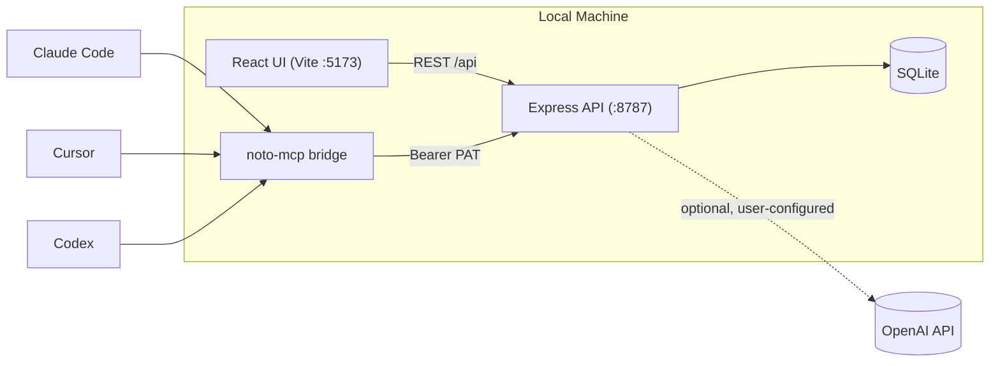

# Noto GitHub README Redesign — Design Spec

**Date:** 2026-07-08
**Status:** Approved, ready for implementation planning

## Overview

Noto's root `README.md` is about to become the front door for the project's first
public release. The current README (58 lines) is accurate but bare: no screenshots,
no diagrams, no positioning against alternatives. This spec redesigns it into a
visually-driven, credible README, informed by reading three well-regarded reference
READMEs (`nexu-io/open-design`, `openclaw/openclaw`, `Graphify-Labs/graphify`) and
scoped tightly to what's actually true about Noto today: a solo/small pre-launch
project, not a large OSS community.

This is a content/design spec, not a code architecture spec. It feeds directly into
an implementation plan (via the `writing-plans` skill) that will produce the actual
README, a demo vault, captured screenshots, a restyled benchmark chart, a Mermaid
diagram, and a minimal CI workflow.

## Goals

- A README that opens with the real product (not stock photography or marketing
  copy) and shows, not just tells, what Noto does.
- Positioning content (comparison table, benchmarks) that is factual and specific,
  not vague marketing — matching the credibility bar of the Graphify reference.
- Everything claimed in the README is true the moment it ships: no badges pointing
  at infrastructure that doesn't exist, no community sections implying a community
  that doesn't exist yet.

## Non-goals (explicitly excluded from this pass)

- Roadmap / versioned-milestones section — ages fast, implies commitments not yet made.
- Animated GIF demos — everything in the gallery is a static screenshot.
- Contributor galleries, sponsor logo rows, Discord/community badges, multi-language
  translations, plugin/skill catalogs — all patterns seen in the reference READMEs
  that assume a scale and community Noto doesn't have yet. Can be added honestly
  later as they become true.
- Changes to `landing/README.md`, `landing/server/README.md`, or
  `packaging/pypi/README.md` — out of scope. `packaging/pypi/README.md` in
  particular is a separate, shorter, install-focused file for the PyPI project page;
  it can inherit this treatment later as a fast-follow.

## Ship bundling

This README only makes honest claims if shipped together with three other changes,
all part of the same release milestone:

1. **Flip `doomwoodzz/Noto` from private to public** on GitHub (currently private,
   confirmed via `gh repo view`).
2. **Publish `noto-app` to PyPI** (`twine upload`, per the existing OSS-release plan
   at `docs/superpowers/specs/2026-07-06-noto-local-first-oss-release-design.md`,
   previously described as a deferred manual step — now happening at ship time).
3. **Add a minimal CI workflow** (new — see "New artifacts needed" below) so the CI
   badge is real.

The implementation plan should sequence these before/alongside the README merge, not
after — a public repo with a `[CI: passing]` badge and a dead PyPI link is worse than
no badges at all.

## Content inventory (what exists today)

Found during research, to reuse or explicitly avoid:

| Asset | Path | Verdict |
|---|---|---|
| Brand mark | `landing/public/favicon.svg` | Reuse. Purple abstract glyph, no wordmark, colors `#863bff` / `#7e14ff` / `#ede6ff` / `#47bfff`. |
| "Hero" images | `landing/public/images/{noto-graph.png,features-hero.jpg}` | **Do not reuse.** Both are AI-generated stock photography (a retro CRT computer in a flower meadow) — not product screenshots, not appropriate for a technical README. |
| Marketing mockups | `landing/src/landing/bento/Vis*.tsx` | Reference for visual language only — these are stylized illustrative React components, not literal screenshots. Not embedded directly. |
| Marketing copy | `landing/src/landing/*` | Reuse taglines: "When you listen, Noto remembers.", "Your notes link themselves. The graph grows as you write." |
| Benchmark charts | `docs/benchmarks/token-savings/*.svg`, `docs/benchmarks/output-savings/*.svg` (7 files) | Reuse the underlying data; restyle the rendering (see Benchmarks section below). Currently white background, generic red/green, not on-brand. |
| Local dev vault | `landing/server/data/noto.sqlite` | **Do not use for screenshots.** Confirmed to be scattered test/QA debris across multiple duplicate "My Vault" / "Idk" vaults — not presentable. |
| CI | `.github/workflows/` | Does not exist. Must be created (see below). |
| `CONTRIBUTING.md` | — | Does not exist. Must be created (see below). |

## README structure

Top to bottom, in final order:

1. **Badges row** — see Badges spec below.
2. **Title + tagline** — "# Noto" + "When you listen, Noto remembers." (keep from
   current README).
3. **Short table of contents** — new. The doc is long enough now (11 sections, 6+
   images, a table, a diagram, a chart) to earn one, unlike the three shorter/simpler
   reference READMEs that rely on GitHub's auto-outline.
4. **Hero image** — one static image, dark mode: a split composite showing the
   editor pane and the Knowledge Web graph side by side. Not a literal single-screen
   screenshot — a composed image built from two real captures.
5. **Quick install** — `pip install noto-app` / `noto`, kept prominent and early
   (existing copy, lightly adapted).
6. **Feature gallery** — six entries, see Screenshot plan below.
7. **Comparison table** — Noto vs. Obsidian / Notion / Logseq / Mem, see spec below.
8. **Architecture** — one Mermaid diagram, see spec below (also covers the MCP
   bridge — no separate diagram).
9. **Benchmarks** — one restyled chart + link to the rest, see spec below. Placed
   after Architecture (not before, as originally drafted) — the chart measures
   token savings on the MCP memory layer specifically, which only makes sense once
   the reader has seen the Architecture section explain what that layer is.
10. **Developing** — full dev setup (existing copy, lightly expanded).
11. **Local-first** — privacy/data-location explainer (keep existing copy).
12. **Contributing** — short paragraph pointing at the new `CONTRIBUTING.md`.
13. **License** — MIT (keep).

Rationale for install appearing before the feature gallery/comparison/benchmarks
("product-led" ordering, chosen over "story-led" and "two-track nav" alternatives):
Noto's install is genuinely frictionless (one `pip` command, no accounts, no config)
in a way none of the three reference projects can claim as cleanly — that's worth
leading with. The feature gallery, comparison table, and benchmarks then serve as
reinforcement for readers who scroll further, and as standalone shareable/linkable
content.

## Demo vault plan

A purpose-built fictional lecture-course vault, ~15-20 interlinked notes, created
specifically for screenshots — not derived from the existing dev database or any
real personal notes.

Requirements the vault content must satisfy:

- Enough `[[wiki-links]]` between notes that the Knowledge Web graph shows a
  visibly clustered structure (not a sparse scatter, not a single blob).
- At least one note suitable as "source material" for the Dump-import screenshot
  (e.g. a syllabus or reading list, pasted/uploaded to generate several atomic
  notes).
- At least one note substantial enough to run through the AI lecture flow
  (transcription → summary → flashcards) for the AI Assistant screenshot.
- Coherent enough as a single course (suggested default: an "Introduction to
  Distributed Systems" course — interlocking terms like consensus, replication,
  CAP theorem link naturally; exact topic is an implementation-time choice, not a
  locked decision).

## Screenshot capture plan

All captures dark mode (Noto's `data-theme="dark"`), static PNGs, using the demo
vault above. Suggested filenames under `docs/readme/screenshots/`:

1. `01-hero.png` — composite (not a raw capture): editor pane + Knowledge Web graph,
   composed side by side.
2. `02-workspace.png` — three-pane view (vault sidebar, editor, context panel), a
   note with visible `[[wiki-links]]` and backlinks open.
3. `03-knowledge-web.png` — Knowledge Web graph, full-size, demo vault loaded,
   clusters visible.
4. `04-ai-lecture.png` — AI assistant panel in lecture/transcription mode.
5. `05-smart-search.png` — ⌘⇧F Smart Search overlay, mid-query, semantic results
   visible.
6. `06-dump-import.png` — Dump import flow, e.g. pasting/uploading the demo course's
   syllabus.

No screenshot for the MCP bridge — it's represented in the architecture diagram
instead (section 8), since there's no single "screen" that represents a protocol
integration.

## Architecture diagram spec

One Mermaid diagram (renders natively on GitHub, stays maintainable as text),
covering both general architecture and the MCP bridge. Starting content for the
implementation plan to refine:

Key point the diagram must make visually: everything inside "Local Machine" never
leaves the device unless the user explicitly configures the optional OpenAI edge —
this is Noto's core positioning claim and the diagram is partly there to prove it.

## Comparison table spec

Noto vs. Obsidian, Notion, Logseq, Mem. Draft content below — **flagged for a
factual sanity-check before publishing**, since these are drawn from general
knowledge that may have drifted (assistant knowledge cutoff is January 2026;
these products iterate quickly).

| | Noto | Obsidian | Notion | Logseq | Mem |
|---|---|---|---|---|---|
| Local-first (data lives on your disk) | ✅ | ✅ | ❌ | ✅ | ❌ |
| No account / sign-in required | ✅ | ✅ | ❌ | ✅ | ❌ |
| Open source | ✅ | ❌ | ❌ | ✅ | ❌ |
| Built-in AI (chat, lecture transcription, flashcards) | ✅ | plugin-only | ✅ (paid tier) | plugin-only | ✅ (core) |
| Knowledge graph view | ✅ | ✅ | ❌ | ✅ | ❌ |
| MCP / AI-agent bridge | ✅ | ❌ | ❌ | ❌ | ❌ |

Tone requirement: factual and specific, not disparaging — matches how Graphify's
benchmark table names exact competitors (mem0, supermemory) with measured claims
rather than vague comparisons.

## Benchmarks spec

- Restyle, don't redesign: edit the color constants in
  `landing/scripts/render-token-savings.mts` (the script behind `npm run
  benchmark:tokens`) to use Noto's brand palette (`#863bff` purple / `#47bfff` cyan)
  on a dark background matching the screenshot gallery, replacing the current plain
  white background and generic red/green bars. (Bonus: moving off red/green also
  sidesteps a red-green colorblindness accessibility issue in the current charts.)
- Feature exactly one chart inline in the README: the platform-comparison chart
  (Noto vs. Obsidian, −80% input / −34% output / −78% combined tokens on a 12-turn
  agentic session) — this is the single chart that tells the whole story in one
  image.
- Link to `docs/benchmarks/` for the other 6 charts and full methodology, rather
  than embedding all 7.
- Placement: after the Architecture diagram (see README structure above) — the
  chart measures token savings on the MCP memory layer specifically, so it lands
  right after the section that explains what that layer is.

## Badges spec

Row order: **License · CI status · Node ≥24 · PyPI version · PyPI downloads**

- License: static MIT badge (shields.io, no external calls needed).
- CI status: `shields.io` GitHub Actions workflow badge, pointing at the new
  workflow below. Only goes green once the workflow exists and has run.
- Node ≥24: static badge, matches the documented requirement in the current README.
- PyPI version + downloads: shields.io PyPI badges, only valid once `noto-app` is
  actually published (see Ship bundling above).

## New artifacts needed

Two small additions beyond the README itself, both approved as in-scope:

1. **`.github/workflows/ci.yml`** — minimal workflow, triggered on push/PR to
   `main`: `cd landing && npm ci && npm run lint && npm run typecheck:server && npm
   test`. Single Node version (24), no matrix — kept minimal per the approved scope
   ("add a minimal CI workflow", not a full CI/CD overhaul).
2. **`CONTRIBUTING.md`** — a few lines: dev setup (pointing at the README's
   Developing section rather than duplicating it), PR expectations. Reasonable
   hygiene given the repo is about to accept outside eyes for the first time.

## Open verification items (carry into implementation plan)

- Comparison table's per-competitor facts need a live sanity-check before publish.
- Confirm Mermaid renders correctly in GitHub's README preview before finalizing
  (quick manual check once the PR is up).
- Demo vault's exact course topic is a free implementation choice (suggested
  default: "Introduction to Distributed Systems"), not a locked decision.

## Handoff

Next step: `writing-plans` skill produces the implementation plan (demo vault
content → screenshot capture via the app's dev server → chart restyle → Mermaid
diagram → CI workflow → CONTRIBUTING.md → README assembly → ship-bundling
sequencing).
